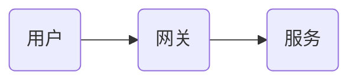
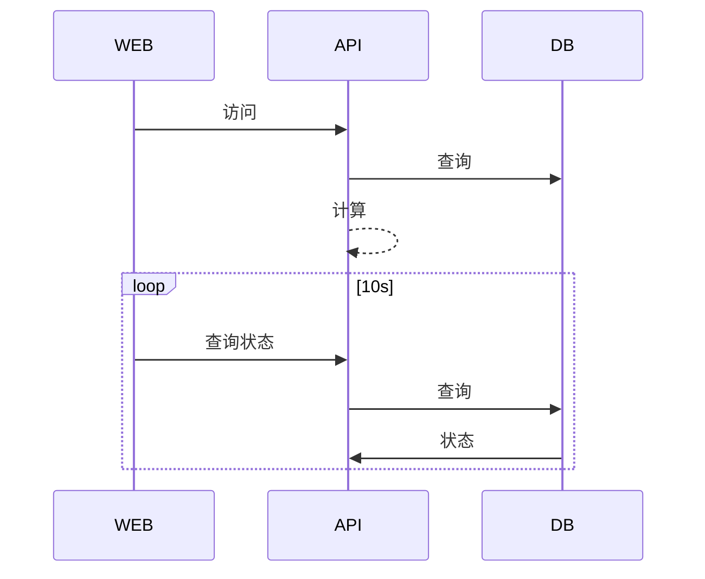

## 目的和场景
> 这个功能或者优化的目的是什么？使用在哪个场景中。

## 详细需求
>  细化需求，要讲清楚这个功能用户是怎么使用和交互的。包括UI设计。

## 系统设计
> 系统如何设计和优化，实现需求。通过流程图和时序图描述系统组件之间的交互和通信。

### 流程图示例

### 时序图示例

## 数据库设计

> 涉及到的数据库表结构变化或者字典数据字段值的准备。

## 接口设计
> 对外接口

## 部署和投产说明
> 功能部署到测试环境或者投产到客户现场时需要哪些工作。
