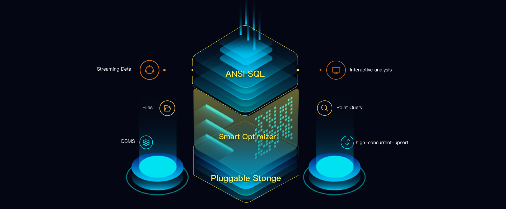

# DingoDB

DingoDB is a real-time Hybrid Serving & Analytical Processing (HSAP) Database. It can execute high-frequency queries and
upsert, interactive analysis, multi-dimensional analysis in extremely low latency.

## Features

1. Compliant with ANSI SQL  
   Based on the popular [Apache Calcite](https://calcite.apache.org/) SQL engine, DingoDB can parse, optimize and
   execute standard SQL statements, and is capable to run part of TPC-H and TPC-DS (See [TPC](http://www.tpc.org/))
   queries. DingoDB is also compliant with JDBC and can be seamlessly integrated with web services, BI tools, etc.
2. Support high frequency write operation  
   By using the log-structured key-value storage [RocksDB](https://rocksdb.org/), DingoDB support high frequency write
   operations like INSERT, UPDATE, DELETE.
3. Support point query and multi-dimensional analysis simultaneously  
   DingoDB can store table data in both row-oriented and column-oriented format, providing capability of fast point
   query and fast multi-dimensional analysis in low latency.
4. Easily integrated with streaming data and other DBMS's  
   By providing dedicated APIs for popular streaming data processing engine,
   e.g. [Apache Flink](https://flink.apache.org/), DingoDB can easily accept data from them, and support more analysis
   working or web serving that is not applicable to be done in stream. DingoDB can also access databases of many types,
   using pluggable connectors for each of them.
5. Resilience for deployment and maintenance  
   DingoDB stores and processes data in a distributed manner with strong cluster and resource management functionality,
   which make it easy to expand the capacity.

## Developing DingoDB

We recommend IntelliJ IDEA to develop the DingoDB codebase. Minimal requirements for an IDE are:

* Support for Java
* Support for Gradle

### IntelliJ IDEA

The IntelliJ IDE supports Java and Gradle out of the box. Download it
at [IntelliJ IDEA website](https://www.jetbrains.com/idea/).

## Documentation

The documentation of DingoDB is located on the website: [https://dingodb.readthedocs.io](https://dingodb.readthedocs.io)
or in the `docs/` directory of the source code.

## About

DingoDB is an open source project licensed in **Apache License Version 2.0**. DingoDB relies on some third-party components, and their open source protocol is also Apache License 2.0.
In addition, DingoDB also directly references some code (possibly with minor changes), which open source protocol is Apache License 2.0, including
- [SOFAJRaft](https://github.com/sofastack/sofa-jraft/)
