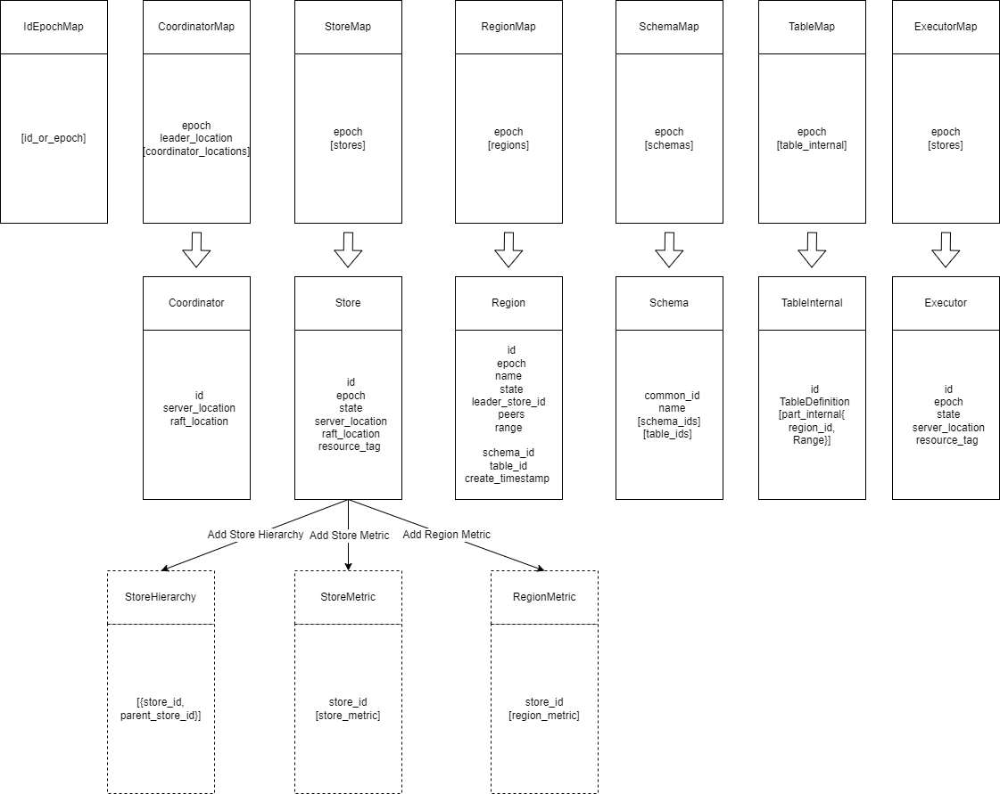
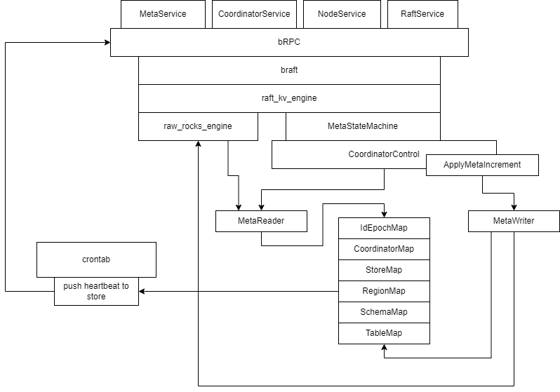
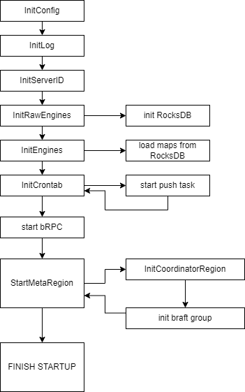

# Coordinator architecture

The data structure of the Coordinator and the processes related to cluster management are described in detail in the article Cluster Management Mechanism. This article mainly describes the code module distribution and main code flow of the Coordinator.

## 1. Data structure

Coordinator mainly maintains 6 main Maps:

- IdEpochMap: Save all Map epochs, and all instance ids (coordinator, store, schema, table)
- CoordinatorMap:Save all Coordinators information and state
- StoreMap: Save information and state of all Stores
- RegionMap: The most important Map, which saves the information and status of all Regions
- SchemaMap & TableMap: Save the information of schema and table respectively. For table, the mapping relationship of table→region is saved

## 2. Code Modules

- MetaService: Database Schema and Table related services, use server_location
- CoordinatorService: For services related to cluster management, use server_location
- NodeService: The service for querying node information in the cluster, using raft_location
- RaftService: Raft data synchronization service, using raft_location

## 3. Start process

