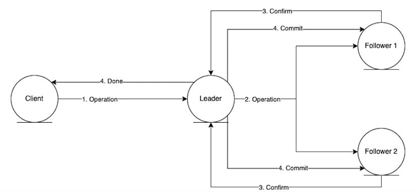
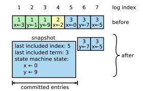
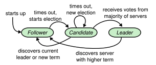

# Distributed Key-Value Store

## Raft
Dingo KvStore is based on [Raft Algorithm](https://raft.github.io/raft.pdf). Raft is a consensus algorithm for managing a replicated log. It produces a result equivalent to (multi-)Paxos, and it is as efficient as Paxos, but its structure is different from Paxos; this makes Raft more understandable than Paxos and also provides a better foundation for building practical systems. In order to enhance understandability, Raft separates the key elements of consensus, such as leader election, log replication, and safety, and it enforces a stronger degree of coherency to reduce the number of states that must be considered. Results from a user study demonstrate that Raft is easier for students to learn than Paxos. Raft also includes a new mechanism for changing the cluster membership, which uses overlapping majorities to guarantee safety. Raft algorithms allow a collection of machines to work as a coherent group that can survive the failures of some of its members.


Raft is similar in many ways to existing consensus algorithms (most notably, Oki and Liskov’s Viewstamped Replication), but it has several novel features:

1. Strong leader:   
   Raft uses a stronger form of leadership than other consensus algorithms. For example, log entries only flow from the leader to other servers. This simplifies the management of the replicated log and makes Raft easier to understand.
2. Leader election:   
   Raft uses randomized timers to elect leaders. This adds only a small amount of mechanism to the heartbeats already required for any consensus algorithm, while resolving conflicts simply and rapidly.
3. Membership changes:   
   Raft’s mechanism for changing the set of servers in the cluster uses a new joint consensus approach where the majorities of two different configurations overlap during transitions. This allows the cluster to continue operating normally during configuration changes.

Raft arise in the context of replicated state machines. In this approach, state machines on a collection of servers compute identical copies of the same state and can continue operating even if some of the servers are down. Raft manages a replicated log containing state machine commands from clients. The state machines process identical sequences of commands from the logs, so they produce the same outputs.    


### Log Replication
Only leader servicies client requests. Each client request contains a command to be executed by the replicated state machines. The leader appends the command to its log as a new entry, then issues AppendEntries RPCs in parallel to each of the other servers to replicate the entry. When the entry has been safely replicated, the leader applies the entry to its state machine and returns the result of that execution to the client. If followers crash or run slowly, or if network packets are lost, the leader retries AppendEntries RPCs indefinitely (even after it has responded to the client) until all followers eventually store all log entries.

Each log entry stores  a state machine command along with the term number when the entry was received by the leader. The term numbers in log entries are used to detect inconsistencies between logs. Each log entry also has an integer index identifying its position in the log.

```
io.dingodb.raft.entity.LogId
```


The leader decides when it is safe to apply a log entry to the state machines; such an entry is called committed. Raft guarantees that committed entries are durable and will eventually be executed by all of the available state machines. A log entry is committed once the leader that created the entry has replicated it on a majority of the servers. This also commits all preceding entries in the leader’s log, including entries created by previous leaders. leader creates at most one entry with a given log index in a given term, and log entries never change their position in the log. When sending an AppendEntries RPC, the leader includes the index and term of the entry in its log that immediately precedes the new entries. If the follower does not find an entry in its log with the same index and term, then it refuses the new entries.

```
Leader: io.dingodb.raft.core.Replicator#sendEntries
Follower: io.dingodb.raft.core.NodeImpl#handleAppendEntriesRequest
Leader: io.dingodb.raft.core.Replicator#onAppendEntriesReturned
```


### Snapshot
Snapshotting is the simplest approach to compaction. Raft’s log grows during normal operation to incorporate more client requests, but in a practical system, it cannot grow without bound. As the log grows longer, it occupies more space and takes more time to replay. This will eventually cause availability problems without some mechanism to discard obsolete information that has accumulated in the log. In snapshotting, the entire current system state is written to a snapshot on stable storage, then the entire log up to that point is discarded. A server replaces the committed entries in its log with a new snapshot, which stores just the current state.



Each server takes snapshots independently, covering just the committed entries in its log. Most of the work consists of the state machine writing its current state to the snapshot. Raft also includes a small amount of metadata in the snapshot: the last included index is the index of the last entry in the log that the snapshot replaces (the last entry the state machine had applied), and the last included term is the term of this entry. These are preserved to support the AppendEntries consistency check for the first log entry following the snapshot, since that entry needs a previous log index and term. Although servers normally take snapshots independently, the leader must occasionally send snapshots to followers that lag behind. The leader uses a new RPC called InstallSnapshot to send snapshots to followers that are too far behind. When a follower receives a snapshot with this RPC, it must decide what to do with its existing log entries. Usually the snapshot will contain new information not already in the recipient’s log. In this case, the follower discards its entire log; it is all superseded by the snapshot and may possibly have uncommitted entries that conflict with the snapshot. If instead the follower receives a snapshot that describes a prefix of its log (due to retransmission or by mistake), then log entries covered by the snapshot are deleted but entries following the snapshot are still valid and must be retained.

```
Each Server: io.dingodb.raft.core.NodeImpl#snapshotTimer
Each Server: io.dingodb.raft.core.NodeImpl#handleSnapshotTimeout
Leader: io.dingodb.raft.core.Replicator#installSnapshot
Follower:io.dingodb.raft.core.NodeImpl#handleInstallSnapshot
Leader: io.dingodb.raft.core.Replicator#onInstallSnapshotReturned
```

### Membership Changes
A Raft cluster contains several servers; five is a typical
number, which allows the system to tolerate two failures.
At any given time each server is in one of three states:
leader, follower, or candidate. In normal operation there
is exactly one leader and all of the other servers are followers. Followers are passive: they issue no requests on
their own but simply respond to requests from leaders
and candidates. The leader handles all client requests (if
a client contacts a follower, the follower redirects it to the
leader). The third state, candidate, is used to elect a new
leader. If a follower receives no communication,
it becomes a candidate and initiates an election. A candidate
that receives votes from a majority of the full cluster becomes
the new leader. Leaders typically operate until they fail.    

```
io.dingodb.raft.core.State
```

1. Election    
   Raft uses a heartbeat mechanism to trigger leader election. When servers start up, they begin as followers. A server remains in follower state as long as it receives valid RPCs from a leader or candidate. Leaders send periodic heartbeats (AppendEntries RPCs that carry no log entries) to all followers in order to maintain their authority. If a follower receives no communication over a period of time called the election timeout, then it assumes there is no viable leader and begins an election to choose a new leader. To begin an election, a follower increments its current term and transitions to candidate state. It then votes for  itself and issues RequestVote RPCs in parallel to each of  the other servers in the cluster. A candidate continues in this state until one of three things happens:   
   (a) it wins the election,   
   (b) another server establishes itself as leader, or   
   (c) a period of time goes by with no winner.   
   A candidate wins an election if it receives votes from a majority of the servers in the full cluster for the same term. Each server will vote for at most one candidate in a given term, on a first-come-first-served basis. The majority rule ensures that at most one candidate can win the election for a particular term. Once a candidate wins an election, it becomes leader. It then sends heartbeat messages to all of the other servers to establish its authority and prevent new elections. While waiting for votes, a candidate may receive an AppendEntries RPC from another server claiming to be leader. If the leader’s term (included in its RPC) is at least as large as the candidate’s current term, then the candidate recognizes the leader as legitimate and returns to follower state. If the term in the RPC is smaller than the candidate’s current term, then the candidate rejects the RPC and continues in candidate state. The third possible outcome is that a candidate neither wins nor loses the election: if many followers become candidates at the same time, votes could be split so that no candidate obtains a majority. When this happens, each candidate will time out and start a new election by incrementing its term and initiating another round of RequestVote RPCs. However, without extra measures split votes could repeat indefinitely. Raft uses randomized election timeouts to ensure that split votes are rare and that they are resolved quickly. To prevent split votes in the first place, election timeouts are chosen randomly from a fixed interval (e.g., 150–300ms). This spreads out the servers so that in most cases only a single server will time out; it wins the election and sends heartbeats before any other servers time out. The same mechanism is used to handle split votes. Each candidate restarts its randomized election timeout at the start of an election, and it waits for that timeout to elapse before starting the next election; this reduces the likelihood of another split vote in the new election.
```
Follower: io.dingodb.raft.core.NodeImpl#preVote
Other: io.dingodb.raft.core.NodeImpl#handlePreVoteRequest
Follower: io.dingodb.raft.core.NodeImpl#handlePreVoteResponse
Candidate: io.dingodb.raft.core.NodeImpl#electSelf
Other: io.dingodb.raft.core.NodeImpl#handleRequestVoteRequest
Candidate: io.dingodb.raft.core.NodeImpl#handleRequestVoteResponse
Leader: io.dingodb.raft.core.NodeImpl#becomeLeader
```
2. Follower/Candidate Crashed    
   Follower and candidate crashes are much simpler to handle, and they are both handled in the same way. If a follower or candidate crashes, then future RequestVote and AppendEntries RPCs sent to it will fail. Raft handles these failures by retrying indefinitely; if the crashed server restarts, then the RPC will complete successfully. If a server crashes after completing an RPC but before responding, then it will receive the same RPC again after it restarts. Raft RPCs are idempotent, so this causes no harm. For example, if a follower receives an AppendEntries request that includes log entries already present in its log, it ignores those entries in the new request.
```
io.dingodb.raft.core.ReplicatorGroupImpl#checkReplicator
io.dingodb.raft.core.ReplicatorGroupImpl#stopReplicator
io.dingodb.raft.core.NodeImpl.ConfigurationCtx#addNewPeers
io.dingodb.raft.core.NodeImpl#onCaughtUp
io.dingodb.raft.core.Replicator#waitForCaughtUp
```
3. Leader Crashed    
   The leader must eventually store all of the committed log entries. Log entries only flow in one direction, from leaders to followers, and leaders never overwrite existing entries in their logs. A leader knows that an entry from its current term is committed once that entry is stored on a majority of the servers. If a leader crashes before committing an entry, future leaders will attempt to finish replicating the entry. However, a leader cannot immediately conclude that an entry from a previous term is committed once it is stored on a majority of servers. Raft never commits log entries from previous terms by counting replicas. Only log entries from the leader’s current term are committed by counting replicas; once an entry from the current term has been committed in this way, then all prior entries are committed indirectly because of the Log Matching Property. There are some situations where a leader could safely conclude that an older log entry is committed (for example, if that entry is stored on every server), but Raft takes a more conservative approach for simplicity. Raft incurs this extra complexity in the commitment rules because log entries retain their original term numbers when a leader replicates entries from previous terms. In other consensus algorithms, if a new leader rereplicates entries from prior “terms,” it must do so with its new “term number.” Raft’s approach makes it easier to reason about log entries, since they maintain the same term number over time and across logs. In addition, new leaders in Raft send fewer log entries from previous terms than in other algorithms.    
   a. The committed entry must have been absent from leaderU’s log at the time of its election (leaders never delete or overwrite entries).    
   b. LeaderT replicated the entry on a majority of the cluster, and leaderU received votes from a majority of the cluster. Thus, at least one server (“the voter”) both accepted the entry from leaderT and voted for leaderU. The voter is key to reaching a contradiction.    
   c. The voter must have accepted the committed entry from leaderT before voting for leaderU; otherwise it would have rejected the AppendEntries request from leaderT (its current term would have been higher than T).    
   d. The voter still stored the entry when it voted for leaderU, since every intervening leader contained the entry (by assumption), leaders never remove entries, and followers only remove entries if they conflict with the leader.    
   e. The voter granted its vote to leaderU, so leaderU’s log must have been as up-to-date as the voter’s. This leads to one of two contradictions.    
   f. First, if the voter and leaderU shared the same last log term, then leaderU’s log must have been at least as long as the voter’s, so its log contained every entry in the voter’s log. This is a contradiction, since the voter contained the committed entry and leaderU was assumed not to.    
   g. Otherwise, leaderU’s last log term must have been larger than the voter’s. Moreover, it was larger than T, since the voter’s last log term was at least T (it contains the committed entry from term T). The earlier leader that created leaderU’s last log entry must have contained the committed entry in its log (by assumption). Then, by the Log Matching Property, leaderU’s log must also contain the committed entry, which is a contradiction.     
   h. This completes the contradiction. Thus, the leaders of all terms greater than T must contain all entries from term T that are committed in term T.     
   i. The Log Matching Property guarantees that future leaders will also contain entries that are committed indirectly.
```
io.dingodb.raft.core.NodeImpl#handleTimeoutNowRequest
io.dingodb.raft.core.NodeImpl#handleElectionTimeout
io.dingodb.raft.core.NodeImpl#checkStepDown
io.dingodb.raft.core.NodeImpl#resetLeaderId
io.dingodb.raft.core.FSMCallerImpl#onStopFollowing
io.dingodb.raft.core.NodeImpl#electSelf
```

## Region
A Region group is a Raft group. Region divides the whole Key-Value space into a series of consecutive Key segments. Each Region can be described by [StartKey, EndKey), a left-closed and right-open interval.
```
io.dingodb.store.row.metadata.Region
```
## Store
A physical storage node which may contain one or more regions.

```
io.dingodb.store.row.metadata.Store
```
