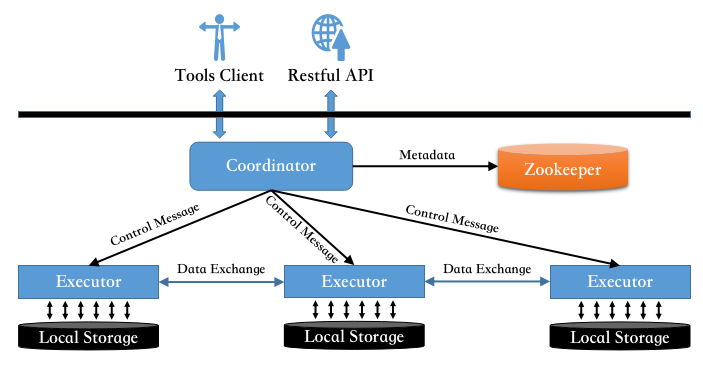

# Architecture Overview

## Introduction

The main architecture of DingoDB is illustrated in the following figure.

The metadata of the database are kept in [Zookeeper](http://zookeeper.apache.org/). When the client request for DDL
operation (e.g. creating or dropping tables), the coordinator will accept the request and modify the metadata stored in
Zookeeper, so the whole cluster will know the modifications. When the client initiate DDL request (e.g. inserting,
updating, deleting data or query the database), the coordinator will accept the request, parse and build job graph for
the request, then distribute the tasks of the job to many executors. Each of the executors will run the tasks dispatched
to it, accessing data in the corresponding local storage, or processing data received from other tasks. Finally, the
result will be collected and returned to the client.

## Terminology

### Coordinator

Coordinators are the computing nodes where the SQL query is initiated, started and the results are collected. There may
be several coordinators in a cluster, but for executing of an SQL statement, only one coordinator is involved.

### Executor

Executors are the computing nodes where the tasks of a job are running.

### Part

Datum in a table are partitioned into multiple parts stored in different locations.

### Location

Generally, a location is defined as a computing node and a path into where parts are stored. A computing node may
contain several locations.

### Job

A job is an execution plan corresponding an SQL DML statement, which contains several tasks.

### Task

A task is defined as directed acyclic graph (DAG) of operators and a specified location.

### Operator

An operator describes a specified operation, which belongs to a specified task. Operators can be "**source operator**"
producing datum for its task, or "**sink operator**" consuming input datum with no datum output, otherwise operators
consume datum coming from the upstream operators, do calculation and transforming, and push the result to its outputs
which connected to downstream operators.

### Tuple

Datum transferred between operators and tasks are generally define as tuples. In Java, a tuple is defined as `Object[]`.
