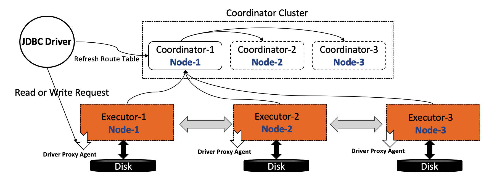

# Distributed Cluster Mode

To achieve high concurrency and high throughput, DingoDB uses an elastic distributed deployment mode. In order to simplify the deployment, this project introduces the deployment of DingoDB using [ansible](https://www.ansible.com/).

## Deploy Architecture View

There are many types of roles in the cluster mode of DingoDB, such as coordinator, executor, driver-proxy, and the cluster mode requires at least three machines. A typical physical deployment architecture is as follows:

## Installation Notes

You can follow this guide to install a 3-nodes DingoDB cluster:

For more details about deplement, you can refer to the [dingo-deploy](https://github.com/dingodb/dingo-deploy) project.