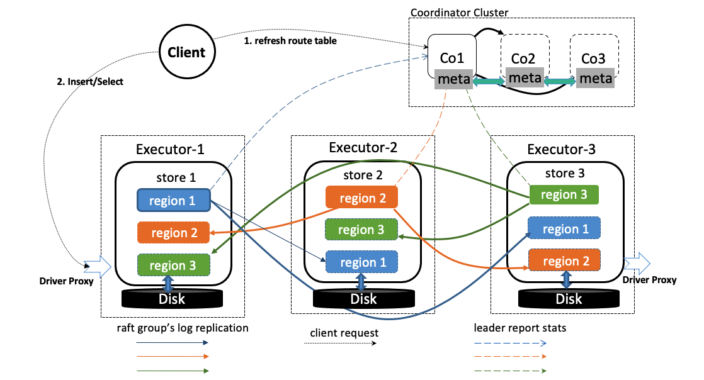

# Architecture

As a distributed database, DingoDB is designed to consist of multiple components. These components communicate with each other and form a complete DingoDB system. The architecture is as follows:

## Computer Layer

The computer layer is a stateless SQL layer that exposes the connection endpoint of DingoDB using JDBC protocol to the outside. The Coordinator receives SQL requests, performs SQL parsing and optimization, and ultimately generates a distributed execution plan. It is horizontally scalable and provides the unified interface to the outside through the load balancing components such as Linux Virtual Server (LVS), HAProxy, or F5. The computer layer does not store data and is only for computing and SQL analyzing, transmitting actual data read requests to the storage layer.

### Coordinator

The Coordinator is the metadata managing component of the entire cluster using raft consensus protocol. It stores metadata of real-time data distribution on `Executor` and the topology structure of the entire DingoDB cluster. The Coordinator server is "the brain" of the entire DingoDB cluster because it not only stores metadata of the cluster, but also sends data scheduling commands to specific `Executor` nodes according to the data distribution state reported by `Executor` nodes in real-time. In addition, the Coordinator server consists of three nodes at least and has high availability. It is recommended to deploy an odd number of Coordinator nodes.

### Executor

The Executor is responsible for storing data. After processing SQL statements, the `Coordinator` server converts the SQL execution plan to an actual call to the Executor API. All the data in Executor is automatically maintained in multiple replicas (three replicas by default), so Executor has native high availability and supports automatic failover.

## Storage Layer

The storage layer supports row and column storage mode. Row mode supports high-frequency insert and update scenarios; Column mode supports interactive analysis and multi-dimensional aggregation analysis in real-time and so on.

### Row Storage

In row storage mode, the store is a distributed key-value storage engine embedded in Executor. The region is the basic unit to store and replicate data. Each Region stores the data for a particular Key Range which is a left-closed and right-open interval from StartKey to EndKey. Multiple Regions exist in each Executor node. Executor APIs provide native support to operator data,  such as get, put, scan, iterator, and so on. 

### Column Storage

To be designed and implemented.

## Clients

Outside the DingoDB cluster, you can use clients to connect to DingoDB to do analysis. The client has Jdbc-driver and Sqlline mode.

### JDBC Driver

JDBC stands for Java Database Connectivity, which is a standard Java API for database-independent connectivity between the Java programming language and a wide range of databases. DingoDB is a flexible distributed database, you can use any database tool embedded [dingo-thin-client](../usage/how_to_use_dingodb.md) to connect to DingoDB such as the universal database tool [dbeaver](https://dbeaver.io/) .

### Sqlline 

SQLLine is a pure-Java console based utility for connecting to DingoDB and executing SQL commands,you can use it like `sqlplus `for Oracle,`mysql` for MySQL. It is implemented with the open source project [sqlline](https://github.com/julianhyde/sqlline).

