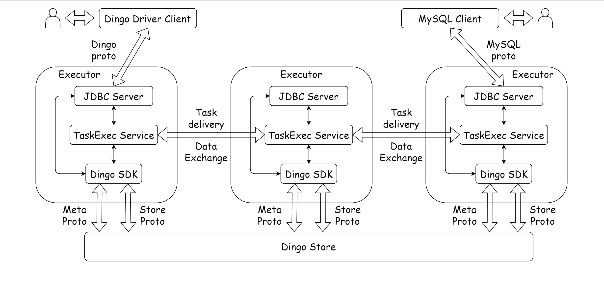
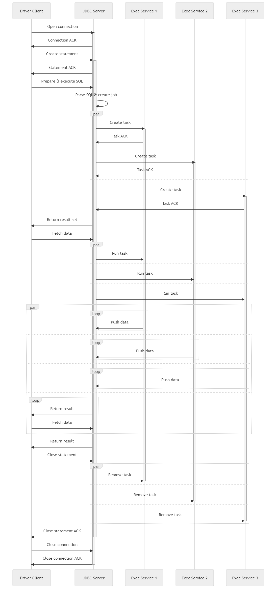
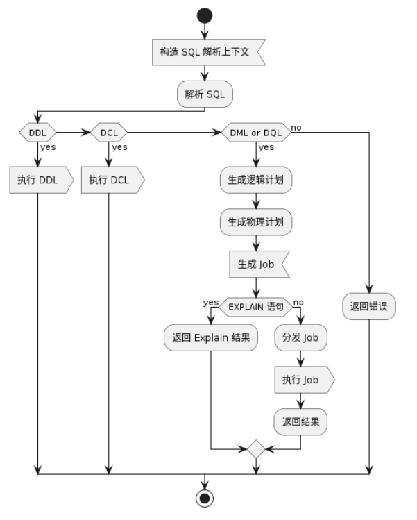
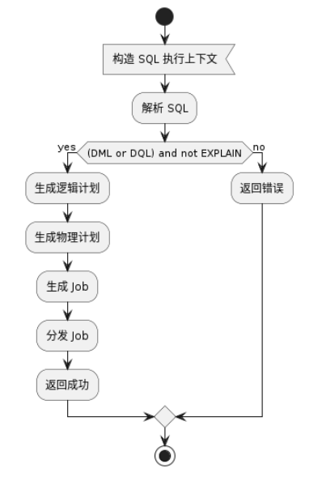
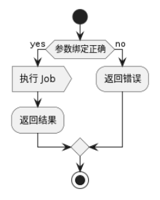
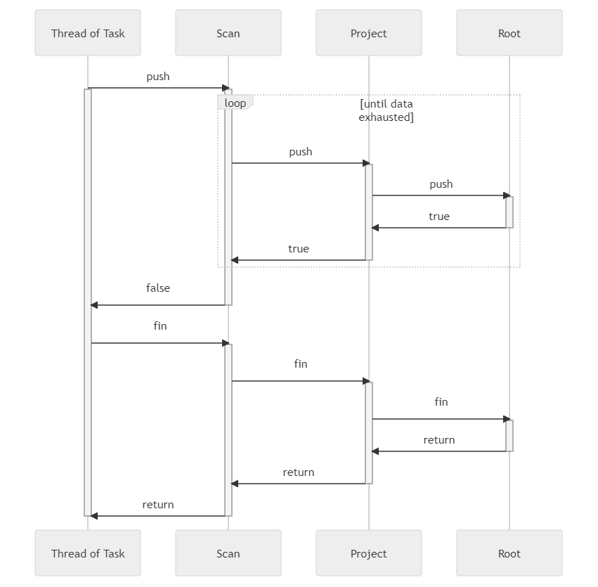
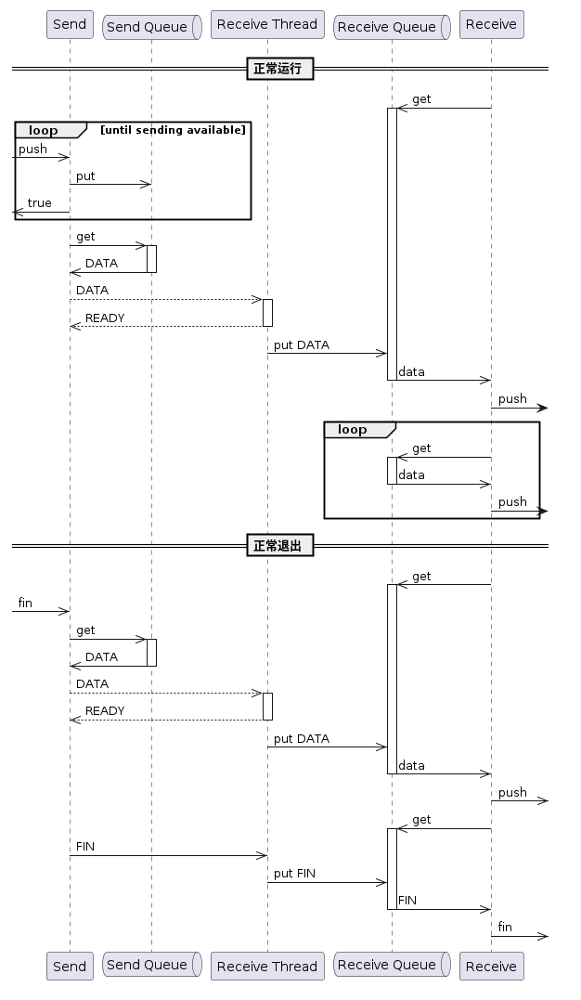

# Executor architecture

## 1. Architecture

**The characteristics of the system are as follows:**
- Start Executor processes on each node in the cluster to provide JDBC services to users. Users can connect to any node.
- Executors provide TaskExec services to each other for task distribution, management, and execution.
- DDL and DCL operations directly call the corresponding interfaces in the Dingo SDK.
- DML and DQL operations are transformed into tasks, and the operators in the tasks call the read and write operations in the Dingo SDK.

## 2. The purpose in Dingo
- Act as a SQL Server, parsing and responding to SQL requests and other management requests from the client side, and implementing the JDBC protocol.
- Manage jobs and implement distributed execution of tasks.
- Implement database functionality by calling the underlying Meta and Store APIs through the SDK.

## 3. The SQL statement execution process is as follows
1. The APP initiates a connection to the JDBC Server through the Driver Client.
2. The APP sends an SQL execution request to the JDBC Server.
3. The JDBC Server parses, validates, and optimizes the received SQL command, gradually generating logical execution plans, physical execution plans, and jobs.
4. The JDBC Server distributes the tasks in the job to the TaskExec Service and returns the ResultSet.
5. The APP initiates a data retrieval request.
6. JThe JDBC Server sends a run command to the TaskExec Service.
7. The task starts running, and the resulting data is pushed downstream to the JDBC Server.
8. The JDBC Server returns the data to the APP.
9. If the data is not returned completely, the APP initiates another data retrieval request, and steps 5, 7, and 8 are repeated until all the data is returned (the run command does not need to be sent again).
   The complete timing diagram for a user to connect to a database, execute an SQL statement, and then exit is shown below:
   

Statement and Job do not have a one-to-one relationship. A Statement can be used multiple times to execute multiple SQL statements, each of which corresponds to a separate Job. At any given time, Statement is only associated with one Job.

*There are two ways for users to initiate SQL execution:*
- Direct execution refers to using the JDBC interface's Statement#execute(String sql) method to execute an SQL statement.
 

- Prepare and execute refers to executing parameterized SQL statements. This method corresponds to the JDBC interface's Connection#prepareStatement(String sql) method.
  

  
Translation: The processing flow of executing SQL statements using the JDBC interface Statement#execute() method is as follows:
 

The TaskExec Service caches the distributed tasks, so the already distributed Job can be found by ID without the need for redistribution.

The "Run task" command passes the bound parameters to each Task.

## 4. Data structure
A Job is generated by a physical plan. A Job contains multiple Tasks, and each Task has a Location property that indicates the node address where the Task will be executed.

Each Task is composed of multiple Operators, and each Operator has one or more input ports, called Pins, which are numbered starting from 0. The Operator also has an Outputs property, which represents all output ports and is a list of Outputs. Outputs can contain zero to multiple Outputs, and each Output indicates the ID and Pin number of the next level Operator it is connected to, forming a directed acyclic graph.

## 5. Run task

The Task runs by "pushing data" method. Generally, the push method of an Operator indicates inputting data to one of its ports. After processing the data, the Operator can directly call the push method of Output to output the data, and Output directly calls the push method of the next-level Operator.

Some Operators do not require input data and are called SourceOperators. In this case, their push method serves as the entry point for starting the Task. When the Task is launched, it needs to call the push method of each SourceOperator in parallel.

Some Operators do not output data and are called SinkOperators.

The push method of an Operator returns a boolean value. If it is false, it means that the next-level Operator does not need more data. At this point, data processing needs to be stopped and false needs to be returned. When the push method of a SourceOperator returns false, the thread it is in will call its fin method once and then exit. The execution logic of the fin method is the same as that of the push method but without a return value. When all threads of the Task exit, the Task execution ends.

Here is the sequence diagram for its execution:

The thread starts by calling the push method of Scan. In the push method, Scan loops through all the data and pushes it to the next level. When the data is exhausted, it returns false, and the Task thread calls the fin method and ends. If the push method of Root returns false (for example, when there is a LIMIT clause in the SQL statement), the false return value is propagated to the upper level and causes Scan to terminate the enumeration loop prematurely.

## 6. Network transmission
Using a pair of Send and Receive operators, data can be transmitted between nodes. Send belongs to the data SinkOperator, and Receive belongs to the SourceOperator. Here is the sequence diagram for transmitting data between nodes:

To improve transmission efficiency, both Send and Receive have corresponding data queues. After Send is pushed with data once, it is not immediately sent, but is placed in the sending queue. It is packaged and sent as a whole when certain conditions are met.

Data is transmitted through the logical Channel established between Send and Receive, and the receiving thread unpacks the received data and puts it into the receiving queue. Receive retrieves data from the receiving queue and pushes it to the downstream operator.

The receiving thread has the following three responses to the sender:

| Response | Meaning                                            | Operations after Send receives the response                                                           |
|----------|----------------------------------------------------|-------------------------------------------------------------------------------------------------------|
| READY    | Indicates that the sender can continue to send data | Continue running and return true to the upstream operator                                             |
| STOP	    | Indicates a pause in sending data                  | The thread is suspended until it receives READY or QUIT                                               |
| QUIT     | Indicates that no more data is needed              | Clear the sending queue and return false to the upstream operator (FIN will also be sent at the end). |
