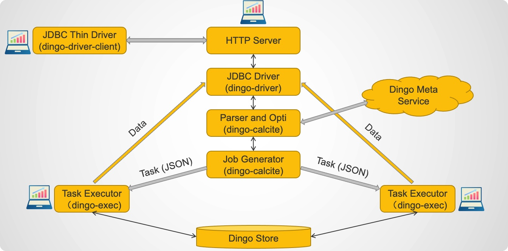
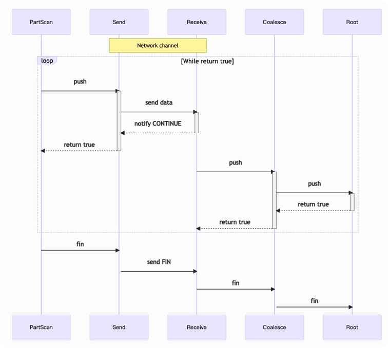

# SQL Execution


## Execution about SQL

The execution plan about SQL is as follows:



1. Parsing an SQL string into a job graph.

```{mermaid}
flowchart TD
    S[SQL string] -->|parsing| L[Logical Plan]
    L -->|transforming & optimizing| P[Physical Plan]
    P -->|building| J[Job Graph]
```
This is done on the coordinator.

2. Distribute the job.

After the job is generated and verified, the tasks of it are serialized and transferred according to their binding
locations. Executors receive and deserialize these tasks.

3. Running the job.

Each task is initiated and executed on its executor. A "**PUSH**" model is used in task executing, that is, the source
operators produce tuples actively and all operators except sink operators push tuples to the outputs actively.

4. Data exchange.

The data exchange is done by a pair of special operators: "**send operator**" and "**receive operator**". They belong to
two tasks at two different locations. The "send operator" is a sink operator in a task, which send the tuples being
pushed to the paired "receive operator" via net links; the "receive operator" is a source operator in a task, which
receive tuples from net link and push them to output.

5. Finish job.

If a source operator exhausted the source, (e.g., a part scan operator iterated over all the data in a table part), a
special tuple "**FIN**" is pushed to its outputs, then the operator quit executing and destroyed. If all the inputs of
an operator received "FIN", it also pushes "FIN" to its outputs, quit executing and destroyed.

"FIN" can be transferred over net link, so it is can be propagated over all operators of all tasks.


## Sequence Diagram of Running


