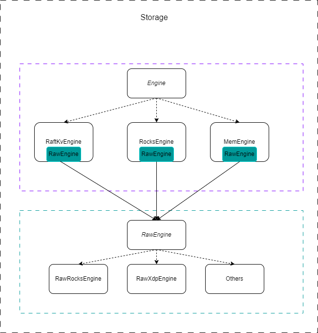
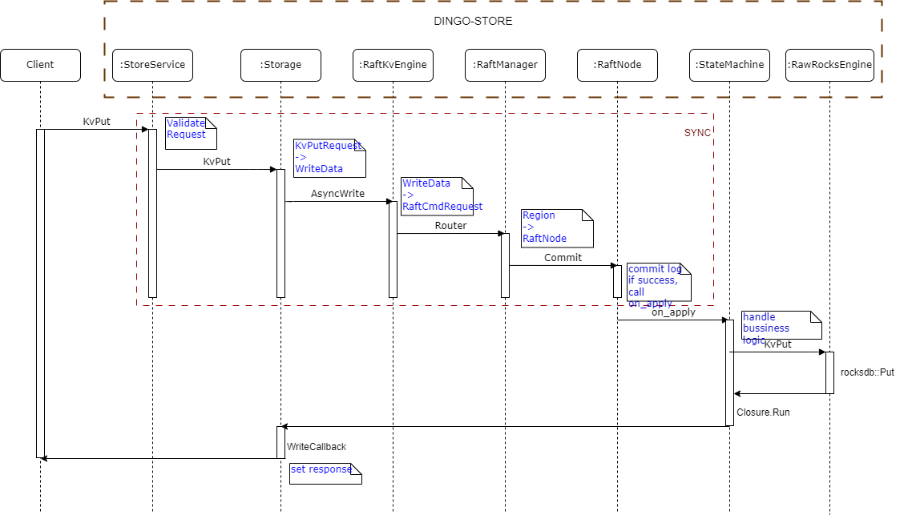
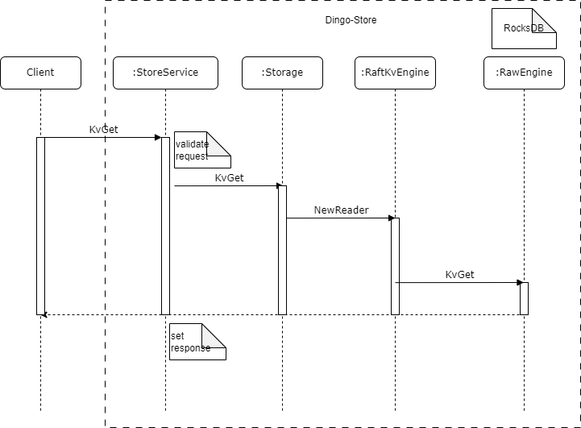
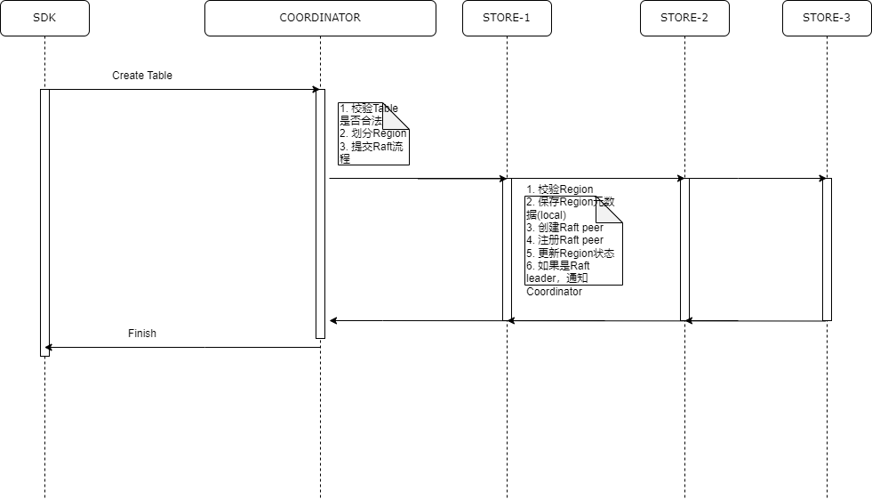
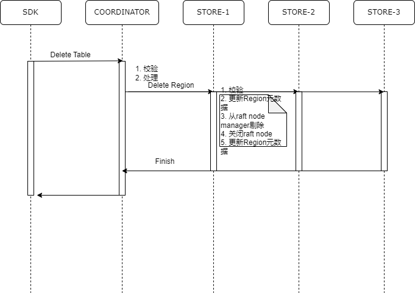

# Store architecture

It is designed with the goal of highly decoupling and componentization of each module, no direct dependencies between components, and multiple implementations of components, so that the system has strong scalability.

## 1.Architecture diagram

The Storage class is responsible for managing the entire storage system, which consists of two layers of storage engines: the upper layer is the Engine, and the lower layer is the RawEngine. Engine and RawEngine are abstract interface classes that can have multiple implementations, such as RocksEngine, RaftKvEngine, MemEngine, etc.

RawEngine is the underlying engine, acting as a wrapper, and can also have multiple implementations. Engine can contain RawEngine internally.

- RaftKvEngine is a distributed storage engine based on Raft and is used in production environments.
- RocksEngine is a single-node storage engine with a single replica, which can be used in both production and testing environments.
- MemEngine is a memory-based storage engine mainly used for testing.
- RawRocksEngine is a direct wrapper of RocksDB, encapsulating the implementation details of RocksDB and providing easy-to-use interfaces to the upper layer.

## 2. Storage method

Using Key/Value memory storage, since Key/Value is a binary byte array, it is not very appropriate to store it directly with std::string. You can use RocksDB's Slice class to represent it, which can reduce data copying during data transfer.

- KvPUT

- KvGet

## 3. Metadata management
*StoreServerMeta：* Manage the state of the store node, without persistence, it can be obtained from the configuration file when the store node starts.

*StoreRegionMeta：* Manage all the region meta information on the store node, which needs to be persisted and reported to the coordinator regularly.

- Persistence 
  - key: META_REGION_{region_id} 
  - value: pb protocol pb::common::Region serialization
  - keep only the latest version
  - Persist immediately when the state of the region changes
  - The version of the region is represented by the epoch field. When the state of the region changes, the epoch will also change, and the epoch will increase monotonically.
  
*StoreMetaManager：*Manage all metadata of store, including StoreServerMeta and StoreRegionMeta.
## 4.Implementation process

- Create Table/Region

1. Verify that partitions can be created.
    * epoch==0&&state=NEW && NotExist(region)
    * whether Range is legal.
    * peers contains the current store node.
2. Save Region metadata
3. Create Raft peers.
4. Initialize Raft peer.
5. Add to Raft node manager.
6. Update the Region status.
7. If it is a Raft leader, notify the coordinator

*Annotation:*

Region should have two states, one is the state of the Peer corresponding to the Region (Region-Peer-State), and the other is the state of the Region (Region-State). Region-State is maintained by Coordinator, and Region-Peer-State is maintained by Store.

- Delete Table/Region
  
  
1. Verify if the Region can be destroyed.
2. Update the Region metadata.
3. Prepare to destroy the Region.
4. Remove from the Raft node manager.
5. Shut down the Raft node.
6. Update the Region metadata.
7. Notify the Coordinator.

*Annotation:*
The Coordinator considers the deletion of the table successful only when it receives confirmation of successful deletion from more than half of the Stores.

- Store Initialization:
  1. Initialize configuration files.
  2. Initialize service logs.
  3. Verify if the Coordinator exists and is valid.
  4. Initialize the service ID by first reading from the local file. If it does not exist, obtain it from the Coordinator.
  5. Initialize the region for the current service node obtained from the Coordinator.
  6. Initialize the storage engine.
  7. Initialize the StoreService.
