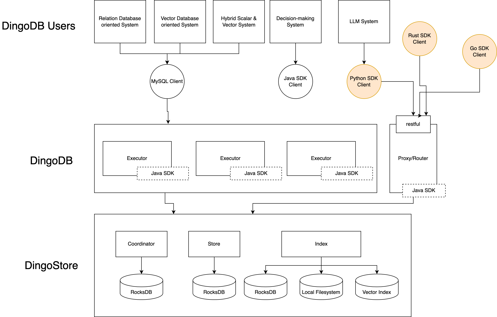
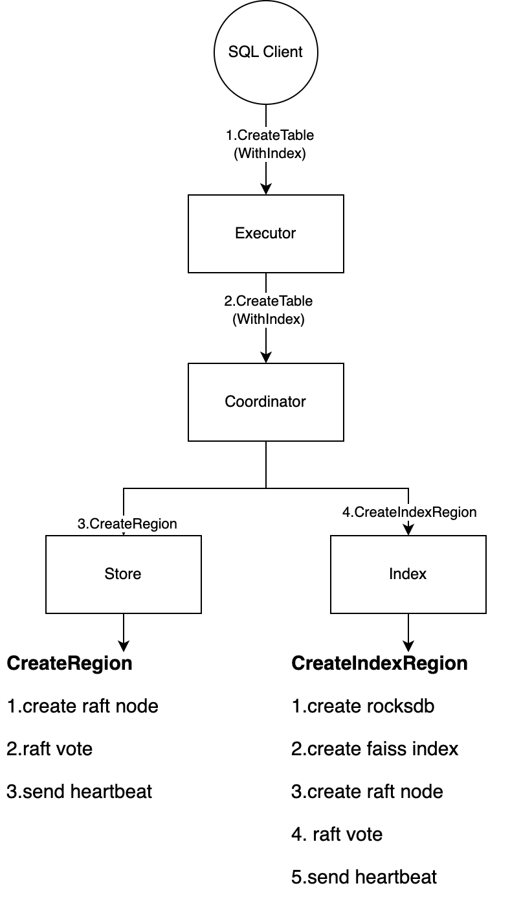
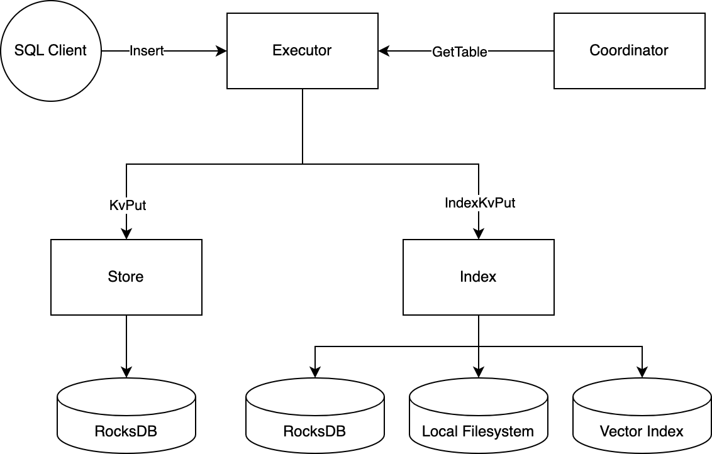
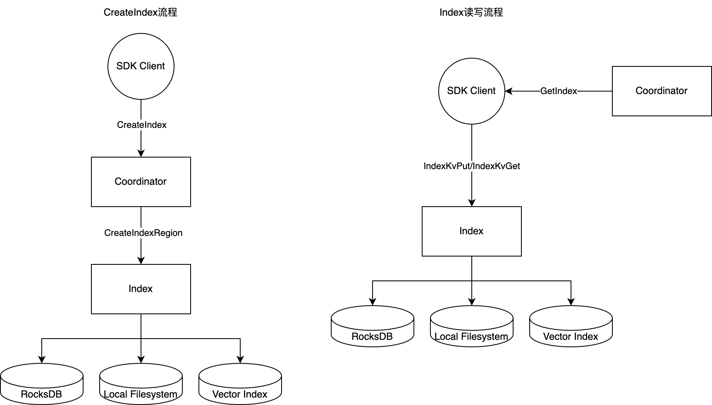

# Vector Index architecture

## Noun Definition
| Noun            | Definition                                                                                        |
|-----------------|---------------------------------------------------------------------------------------------------|
| Table           | Dingo's Table.                                                                                    |
| IndexDefinition | Dingo's index definition.                                                                         |
| Index           | Dingo's index is equivalent to a key-value storage, specifically for vector-type indexes. For vector indexes, it stores the complete vector, vector UUID, and vector metadata. It utilizes third-party libraries like Faiss to generate vector indexes.|

## Architecture design
The overall component diagram of the new DingoDB after adding Dingo-Index:

In the overall semantics of DingoDB, a new Index concept is added at the same level as Table, and the Coordinator is correspondingly enhanced with Index management and gRPC interface.

In the first iteration, only VectorIndex is temporarily considered to be supported. Scalar Index will be supported in the subsequent iterations.

Support for simultaneous creation of Index is added when creating a table using CreateTable.

Support for CreateIndex is added, allowing users to use Index directly as a Collection concept in general Vector Databases, just like using purely Vector Databases such as Milvus and Chroma.

This design enables DingoDB to implement SQL on Vector like pgvector and clickhouse, while also using Vector as a First Class Citizen like Milvus.

DW Proxy is a component used to implement double-write of Table+Index whose independent existence remains to be determined.

### New I/O Workflow

#### Table creation process
  
  The CreateTable process without an index is the same as in version 0.6.0. The CreateTable process with an index is as follows:
  
  In simple terms, the Coordinator drives the creation of Regions for both Store and Index components.


**The specific process is as follows:** 

1. Due to the current design limitations of DingoDB, if a user wants to use a Table with an Index, the user must declare the index at the time of creating the table.

2. The user executes an SQL statement through an SQL client, similar to the following statement (the specific format of the SQL statement needs to be designed later, and the following statement is only for illustration purposes):

```text
CREATE TABLE items 
(id integer PRIMARY KEY, 
name varchar2(256), 
embedding vector(1024)), 
INDEX vec_index1 (embedding) WITH (index_type=ivfflat, distance=l2, nlists=1024)), 
INDEX name_index1 (name) WITH (index_type=lsm);
```
In the SQL statement above, the user creates a table with three fields, where the 'embedding' field is a 1024-dimensional vector. At the same time, the user declares the creation of two indexes - one vector index based on the 'embedding' field, using the Ivfflat index type, Euclidean distance, and 1024 nlists; and the other is a scalar index based on the 'name' field, using the LSM index type.

3. The Executor generates a gRPC message to call the CreateTable interface of the Coordinator according to the create table statement passed in by the user. Since the user requests to create an index, in addition to the TableDefinition, an IndexDefinition also needs to be generated. For the example above, two IndexDefinitions need to be generated.

4. After receiving the gRPC request for CreateTable, the Coordinator parses the TableDefinition and IndexDefinition and calls the Store and Index nodes respectively to perform the CreateRegion and CreateIndexRegion operations.

5. The Store follows the same CreateRegion process as in version 0.6.0, while the Index completes the CreateIndexRegion process as shown in the figure above.

#### Data read and write process (SQL on Vector)
  
The read and write process for tables without indexes is completely the same as in version 0.6.0.

For tables with indexes, the Executor needs to handle the issue of dual write. When querying data, the Executor generates an execution plan based on the definition of the Table to determine if an index query is needed. If an index query is required, the Executor initiates a query to the Index component.


#### Data read and write process (Vector only)

For scenarios that solely involve langchain, the SQL component is not necessary. Therefore, if users only require the capabilities of Vector, they can directly use Index.

The diagram below illustrates that the SDK client can directly use Index-Vector storage by utilizing the CreateIndex function. During the read and write process, data manipulation is performed using Index-specific interfaces such as Get and Put.

In this case, we can refer to the various APIs implemented by major Vector Databases to meet the requirements of various Vector Search operations.

