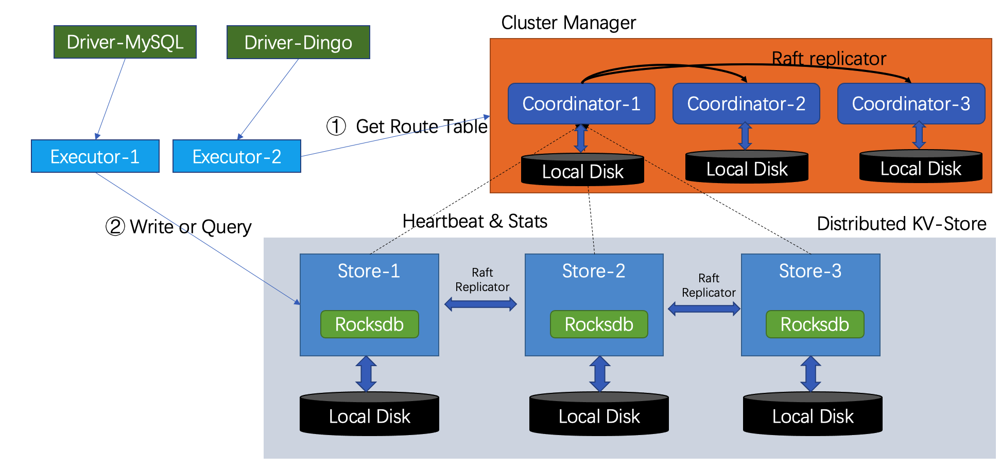

# Deploy DingoDB Cluster By Ansible

[DingoDB](https://github.com/dingodb/dingo) is a real-time Hybrid Serving & Analytical Processing (HSAP) Database. It can execute high-frequency queries and upsert, interactive analysis, multi-dimensional analysis in extremely low latency. To achieve high concurrency and high throughput, DingoDB uses an elastic distributed deployment mode.

In order to simplify the deployment, this project introduces the deployment of DingoDB using [ansible](https://www.ansible.com/).

## 1. Cluster Mode



The roles in the cluster are mainly divided into:

- Coordinator

    Coordinator act as the master of the cluster. It is responsible for the management and scheduler of data replications of DingoDB cluster.

- Store
  
  Store act as the storage of the cluster,  It is responsible for managing the entire storage

- Executor

    Executor act as the worker of the cluster. It is responsible for executing the physical execution plan of  SQL to scan and compute the data.

- Driver-MySQL/Driver-Dingo

    DingoDB uses JDBC driver to perform table-level data operations, such as create, insert, update, delete, etc. Driver Proxy act as the proxy of JDBC Connection.

### 1.1 Installation prerequisites
- Version of OS

    CentOS 8.x.

- Repository of Yum works fine

    The repository will be used to install basic tools needed by the cluster, such as `python3`.

- Ansible Host

    A host installed with `ansible` is required to  distribute cluster configuration and related software modules about DingoDB. This machine can also be replaced by one node in DingoDB cluster such as `Store-1` or `Coordinator-1`.
### 1.2 Deployment Guidelines
 In the cluster mode, `ansible` is selected as the deployment tools. You can use this guide to install a DingoDB cluster.

#### 1.2.1 Install Steps
You can follow this guide to install a dingo cluster:
[](https://asciinema.org/a/kpqwIfdN2NcyUIqHC5RJrmMjK)

#### 1.2.2 Installation Notes
1. define cluster configuration
  
  Edit the configuration inventory/hosts, use the real host, user, password to replace the item.
```shell
 [all:vars]
  ansible_connection=ssh
  ansible_ssh_user=root
  ansible_ssh_pass=123456
  ansible_python_interpreter=/usr/bin/python3

[coordinator]
172.20.3.201
172.20.3.200
172.20.3.202

[store]
# 172.20.3.201
# 172.20.3.201 store_num=2
# 172.20.3.201 store_num=2 disk='/home/sd1 /home/sd2'
172.20.3.201
172.20.3.200
172.20.3.202

[all_nodes:children]
coordinator
store

[executor]
172.20.3.201

[executor_nodes:children]
executor
```
2. Check Python3 is installed

Check Python3 is installed or not on DingoDB cluster, if `Python3` is not installed, We can use ansible to install `Python3` using such command.

```shell
ansible all_nodes --become -m raw -a "yum install -y python3" -i ansible_hosts
```
3. Start to install
* Copy artifacts 
```shell
1. artifacts/jdk-8u171-linux-x64.tar.gz
2. artifacts/dingo.zip
3. artifacts/dingo-store.tar.gz
```
* Executor ansible script
```shell
 ansible-playbook playbook.yml
```
