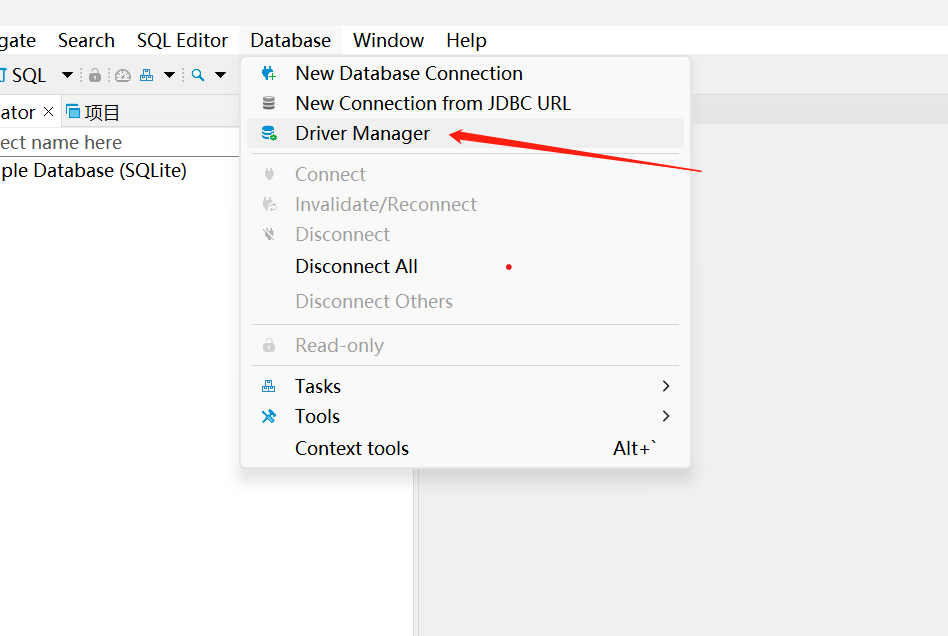
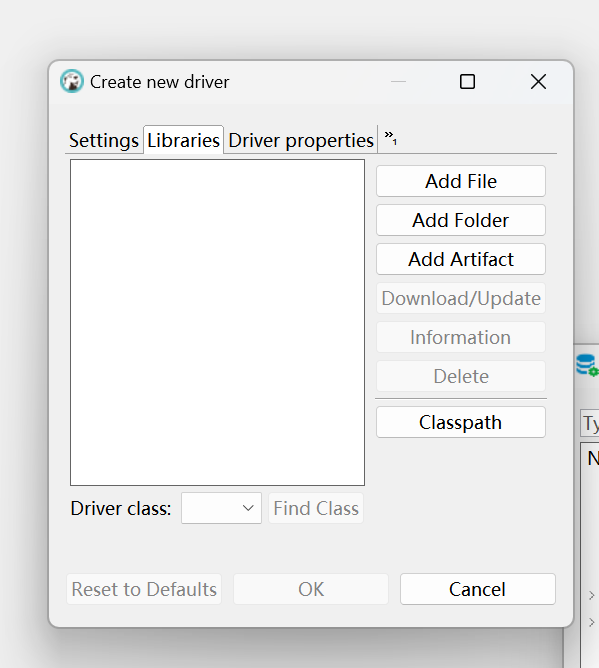
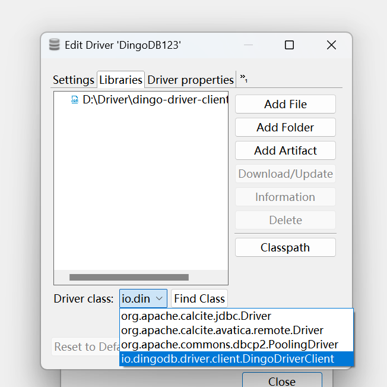
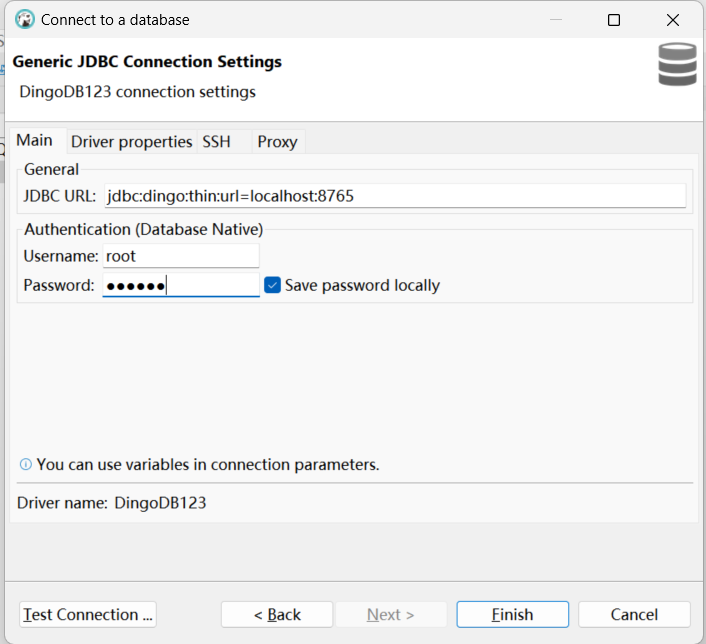
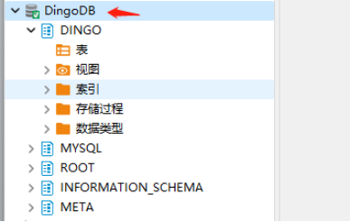

# Play with DingoDB using SQL

## Play DingoDB with SQL Tools

### Setup Connection to DingoDB 

1.Launch DBeaver tool, navigate to menu Window -> Driver Manager



2.In the Driver Manager dialog, click on “New” button,create new driver

3.In the New Driver dialog, provide the “Driver Name” and “Class Name”, here please input the class name as “io.dingodb.driver.client.DingoDriverClient”



4.Then click on the “library” tab, and click “Add file” button.

5.Add the DingoDB driver “dingo-driver-client-all.jar”, click “Search” and select the DingoDB driver “io.dingodb.driver.client.DingoDriverClient”.



6.Click “OK”, then you will see the DingoDB driver shown in driver list.

7.Back to DBeaver main screen, click on “New Database Connection” from the toolbar, and select “DingoDB” item.

8.In New Database Connection dialog, provide valid JDBC URL, User and Password, then “Test Connection” and see the Database connected successfully.



9.Click Finish and see the DingoDB connection displayed in Database Connections Navigator on left.
  


### Do Operation using Editor

You can use dbeaver to view tables and queries.


- Create Table

```sql
create table userinfo (
    id int,
    name varchar(32) not null,
    age int,
    amount double,
    primary key(id)
);
```

- Insert values to Table

```sql
insert into userinfo values
(1, 'Alice', 18, 3.5),
(2, 'Betty', 22, 4.1),
(3, 'Cindy', 39, 4.6),
(4, 'Doris', 25, 5.2),
(5, 'Emily', 24, 5.8),
(6, 'Alice', 32, 6.1),
(7, 'Betty', 30, 6.9),
(8, 'Alice', 22, 7.3),
(9, 'Cindy', 26, 7.5);
```

- Execute Query

1.Query table by condition

```sql
select * from userinfo where id=3;
```

2.Query table by aggregation condition

```sql
select name, sum(amount) as sumAmount from userinfo group by name;
```

3.Query table by `order by`

```sql
select * from userinfo order by id;
```

4.Update table by row or condition

```sql
update userinfo set age = age + 10;
update userinfo set age = age + 10 where id = 1;
```

## Play DingoDB Using Java Code

### Setup Connection

After starting the server, you can connect to the dingodb database:

```Java
Class.forName("io.dingodb.driver.client.DingoDriverClient");
Connection connection = DriverManager.getConnection("jdbc:dingo:thin:url=ip:8765");
```

```jdbc:dingo:thin:url=ip:8765``` is the connection string.

**The IP address should be the actual server IP address, and the default port is 8765.**

### Do Operation using Java

- Create table

```java
Statement statement = connection.createStatement();
String sql = "create table exampleTest ("
            + "id int,"
            + "name varchar(32) not null,"
            + "age int,"
            + "amount double,"
            + "primary key(id)"
            + ")";
statement.execute(sql);
```

- Insert data to table

```java
Statement statement = connection.createStatement();
String sql = "insert into exampleTest values (1, 'example001', 19, 11.0)";
int count = statement.executeUpdate(sql);
```

- Query data from table

```java
Statement statement = connection.createStatement();
String sql = "select * from exampleTest";
try (ResultSet resultSet = statement.executeQuery(sql)) {
  while (resultSet.next()) {
    // iterator the result set
	}
}
```
## Play MySQL Using Java Code

After starting the server, you can connect to the mysql database:

```java
public class MySQLDemo {
    static final String JDBC_DRIVER = "com.mysql.cj.jdbc.Driver";
    static final String connectUrl = "jdbc:mysql://172.20.3.15:3307/dingo";
    private static Connection connection;

    public static void main(String[] args) throws ClassNotFoundException, SQLException {
        String tableName = "myjdbctest1";
        // load driver
        Class.forName(JDBC_DRIVER);
        
        // get connection
        connection = DriverManager.getConnection(connectUrl, "root", "");
        Statement statement = connection.createStatement();
        
        // create table
        String createSql = "create table " + tableName +
                "(" +
                "id int, " +
                "name varchar(20), " +
                "age int, " +
                "amount double, " +
                "primary key(id))";
        statement.execute(createSql);

        // insert record
        for(int i=1; i<=10; i++) {
            String insertSql = "insert into " + tableName +
                    " values (" + i + ",'dingo', 25, 23.45)";
            statement.executeUpdate(insertSql);
        }
        
        // query data
        String querySql = "select * from " + tableName;
        ResultSet resultSet = statement.executeQuery(querySql);
        ResultSetMetaData metaData = resultSet.getMetaData();
        int columnCount = metaData.getColumnCount();
        while (resultSet.next()) {
            for (int i = 1; i <= columnCount; i++) {
                String columnName = metaData.getColumnName(i);
                String s = resultSet.getObject(columnName).toString();
                System.out.println(s);
            }
        }
        resultSet.close();
        
        // get tables
        DatabaseMetaData dmd = connection.getMetaData();
        List<String> tableList = new ArrayList<String>();
        String[] types={"TABLE"};
        ResultSet rst = dmd.getTables(null, "dingo", null, types);
        while (rst.next()) {
            tableList.add(rst.getString("TABLE_NAME").toUpperCase());
        }
        System.out.println("Table list: " + tableList);
        rst.close();
        
        // drop table
        String dropSql = "drop table " + tableName;
        statement.execute(dropSql);
        
        // close resource
        statement.close();
        connection.close();
    }
}
```
