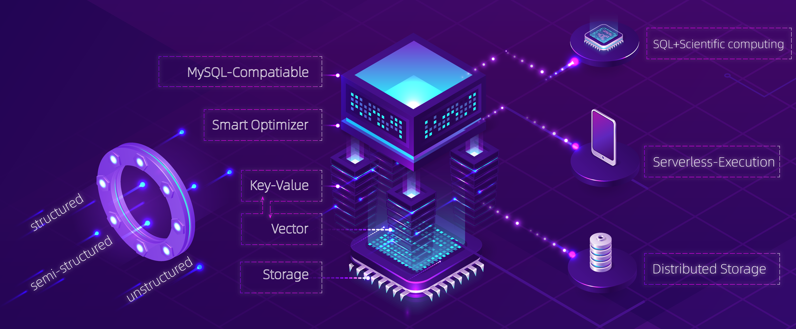

# What is DingoDB

[DingoDB](https://github.com/dingodb/dingo) is a distributed real-time multi-modal database. It combines the features of a data lake and a vector database. It can store any type of data (key-value, PDF, audio, video, etc) with data of any size.Using it, you can build your **Vector Ocean** (The Next Generation data architecture following data warehouse and data lake initiated by [DataCanvas](https://www.datacanvas.com/)) and analyze structured and unstructured data with extremely low latency.

## Key Features

### As A Distributed Vector database for Any Data

1. Offering storage for all data types (embeddings, audio, text, videos, images, pdfs, annotations, etc.)
2. query and vector search in low latency 
3. Perform hybrid search including embeddings and structured data such as label or attributes

### As A Distributed Relation database

1. **Compliant with MySQL-Compatible**

   Based on the popular [Apache Calcite](https://calcite.apache.org/) SQL engine, DingoDB can parse, optimize and
   execute standard SQL statements, and is capable to run part of TPC-H and TPC-DS (See [TPC](http://www.tpc.org/))
   queries. DingoDB is also compliant with MySQL Shell and MySQL-JDBC-Driver Client, So you can be seamlessly integrated with web services, BI tools, etc.

2. **Intelligent Optimizer**

   DingoDB supports row storage, column storage, and row-column hybrid, while table-level supports multi-partition and 
   replica mechanisms. DingoDB's SQL optimizer provides the optimal execution plan based on the metadata of the data, 
   achieving automatic selection of structed and unstructed.

3. **Real-time high-frequency updates** 

   By using [RAFT](https://raft.github.io/) and log-structured key-value storage [RocksDB](https://rocksdb.org/). You can perform high-frequency INSERT, UPDATE, DELETE and short-QUERY while ensuring strong data consistency.  

4. **Multi-replica policy storage**

   By using [RAFT](https://raft.github.io/), DingoDB can store key-value and embedded vectors in multi-nodes with replicates. At the same time, with the increase in data scale, it can easily perform horizontal scaling operations on clusters.

5. **Unified data service** 

   Integrated analysis service, supporting point query, interactive analysis, and offline acceleration; providing 
   high-concurrency microsecond-level data query and second-level data calculation service capabilities; providing 
   7*24-hour service capabilities.

## Use Cases

- **Composite metrics calculation**
   
    Real-time metric services are core to assisting businesses in making real-time decisions. By incorporating multiple efficient calculation operation types, more scenario needs can be met, and the optimal calculation operation type can be provided for different scenarios, thereby generating information that can serve specific domains.

- **Real-time data calculation**
   
    DingoDB is suitable for tracking KPIs and other important metrics, allowing users to build BI dashboards and scorecards to track enterprise goals and metrics in real-time. It provides a fast and concise way to measure KPIs and indicate the progress made by the enterprise towards achieving its goals. In cases of risk control or marketing scenarios.

- **Real-time interactive analysis**

  Users perform interactive data queries and probe data to extract trends and solutions from historical and current discoveries to drive valuable data-driven decisions. Different functional personnel such as HR managers, sales representatives, and marketing teams can make data-driven decisions directly through self-service business intelligence tools supported by DingoDB.

- **Image Similarity Search**

  Major search engines like Google already give users the option to search by image. Additionally, e-commerce platforms have realized the benefits this functionality offers online shoppers, with Amazon incorporating image search into its smartphone applications.

- **Question Answering System**

   Question answering system is a common real world application that belongs to the field of natural language processing. Typical QA systems include online customer service systems, QA chatbots, and more. Most question answering systems can be classified as: generative or retrieval, single-round or multi-round, open-domain or specific question answering systems.
