# Windows

## Install WSL
### 1. Prerequisites
To successfully run WSL 2 on Windows 10+, the following hardware conditions need to be met first:

> * 64-bit processor with Secondary Level Address Translation (SLAT);
> * 4GB of system RAM;
> * Enable hardware virtualization in the BIOS;

* You must be running Windows 10 version 2004 and higher (internal version 19041 and higher) or Windows 11 in order to use the following commands, otherwise a more complex manual installation is required, which is mainly automated here. *## 2) Download and install Windows 10

### 2. Download and install WSL

Open PowerShell or Windows Command Prompt in administrator mode by right-clicking and selecting “Run as administrator”, enter the command 'wsl --install', and restart the computer after the installation is complete**. This command will enable the features needed to run WSL and install the Ubuntu distribution of Linux.

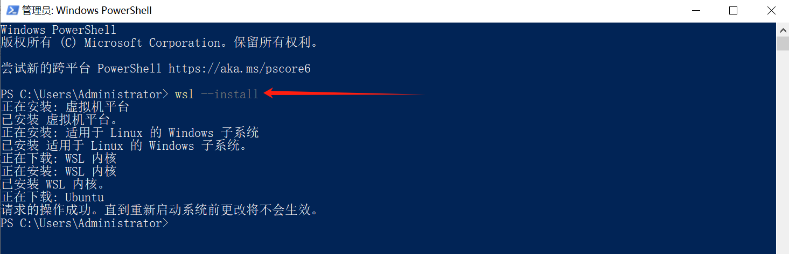

### 3. Reboot your computer
  
Restarting your computer will automatically install the Linux subsystem (Ubuntu by default).

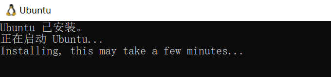

### 4. Check system configuration

Check that Windows subsystems and virtual machine platforms for Linux are checked in Control Panel -> Programs → Enable or Disable Windows Features.

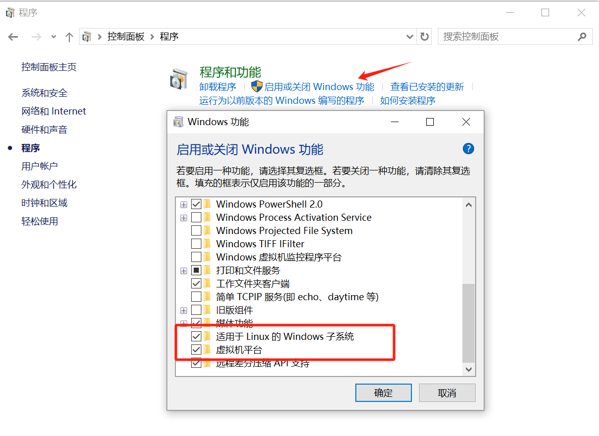

### 5. Setting up a username and password

After installing WSL, you need to create a user account and password for the newly installed Linux distribution. Click on the “Start” menu to open the Linux distribution (Ubuntu by default). At this point, you will be asked to create a username and password for the Linux distribution.
Note that:
> * This username and password is specific to each individual Linux distribution installed, and is not related to the Windows username.
> * Nothing is displayed on the screen when you type your password. This is called blind typing. You will not see what you are typing, and this is perfectly normal.
> * After you create a username and password, this account will be the distribution's default user and will be automatically logged in at startup.
> * This account will be treated as a Linux administrator and will be able to run sudo (Super User Do) administrative commands.
> * Each Linux distribution running on WSL has its own Linux user account and password. A Linux user account must be configured whenever a distribution is added, reinstalled, or reset.

To change or reset the password, open the Linux distribution and enter the command: passwd. You will be asked for your current password, then asked for a new password, and later to confirm the new password.

#### **Forgot Password**

a. Please open PowerShell and enter the root directory of the default WSL distribution with the following command: wsl -u root

> If you need to update the forgotten password in a non-default distribution, use the command: wsl -d Debian -u root and replace Debian with the name of the target distribution.

b. After opening the WSL distribution at the root level within PowerShell, you can update the password using this command: passwd <username>, where <username> is the username of the account in the distribution for which you have forgotten the password.

c. You will be prompted for a new UNIX password, which you can then confirm. After you have been told that the password has been successfully updated, close the WSL from within PowerShell using the following command: exit.

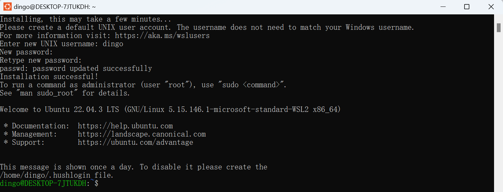

### 6. Checking the WSL version

You can list the installed Linux distributions and check the WSL version of each distribution by entering the following command in PowerShell or at a Windows command prompt: wsl -l -v, default is WSL 2.

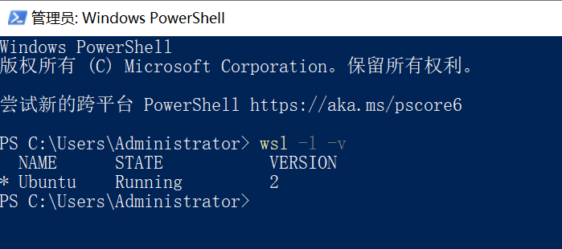

## Install Docker DeskTop

### 1. Prerequisites
> * WSL version 1.1.3.0 or higher.
> * Windows 11 64bit: Home, Professional, Enterprise, and Education editions require version 21H2 or higher.
> * Windows 10 64bit.
> - Push Home requires 22H2 (version 19045) or later for Home, Professional, Enterprise, Education editions.
> - Minimum requirement is 21H2 (version 19044) or later required for Home, Professional, Enterprise, and Education editions.
> * Enable WSL 2 feature on Windows

### 2. Download and install Docker DeskTop

[Docker DeskTop Download](https://desktop.docker.com/win/main/amd64/Docker%20Desktop%20Installer.exe?_gl=1*154qt9t*_ga*MTAyNTc0ODM4My4xNzE1MTUxNTE4*_ga_XJWPQMJYHQ*MTcxNTIzNDg5NC4zLjAuMTcxNTIzNDg5NC42MC4wLjA)

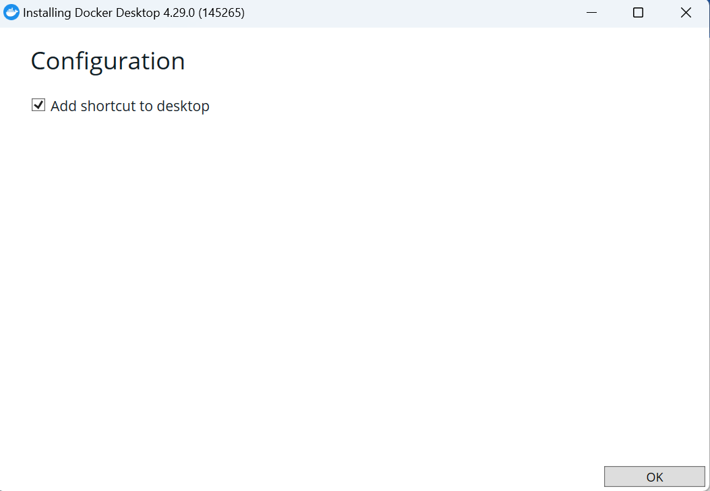


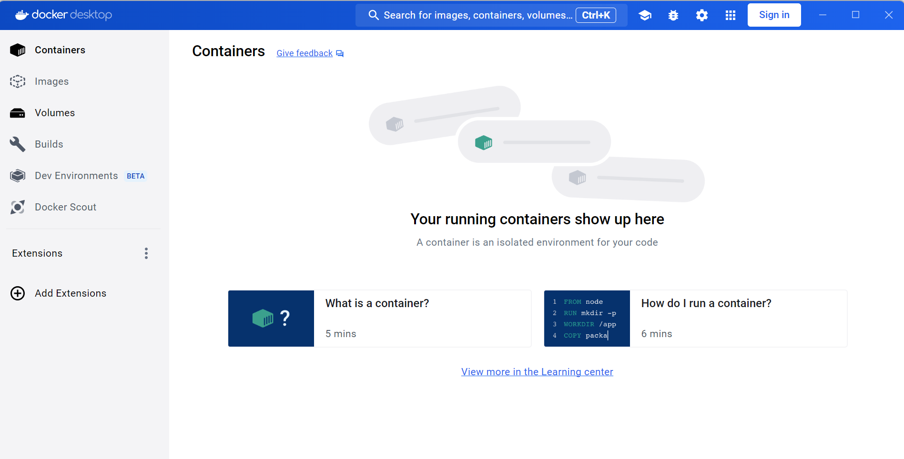

### 3. Starting Docker DeskTop

Installation is complete. If the following error occurs during the startup of Docker Desktop, you can click Update Windows in Windows Settings and restart your computer after the update to resolve the issue.

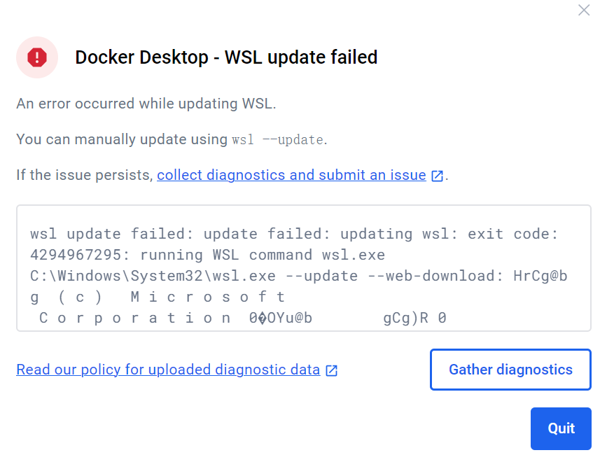

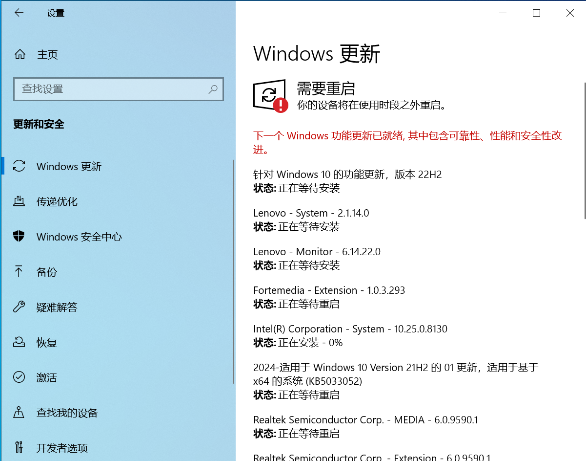

_**Special Note**_

Docker desktop is different from docker in Ubuntu in that it has a special mechanism: it loads a block device inside wsl2, and then uses the full docker environment directly from this block device, including the docker commands, docker proxy, and docker image directory. ubuntu Do not install docker on ubuntu, use docker desktop.

## Docker deployment of standalone DingoDB

### 1. Create docker-compose.lite.yml

Create a new file docker-compose.lite.yml in your Windows directory.
   
```shell
---

x-shared-environment: &shared-env
  SERVER_LISTEN_HOST: 0.0.0.0
  SERVER_HOST: host.docker.internal
  RAFT_LISTEN_HOST: 0.0.0.0
  RAFT_HOST: host.docker.internal
  COOR_RAFT_PEERS: host.docker.internal:22101
  COOR_SRV_PEERS: host.docker.internal:22001
  DEFAULT_REPLICA_NUM: 1
  DINGODB_ENABLE_LITE: 1
  DEFAULT_MIN_SYSTEM_DISK_CAPACITY_FREE_RATIO: 0.05
  DEFAULT_MIN_SYSTEM_MEMORY_CAPACITY_FREE_RATIO: 0.20
  DINGODB_ENABLE_ROCKSDB_SYNC: 1
  DINGODB_ENABLE_REGION_SPLIT_AND_MERGE_FOR_LITE :0
 
services:
  coordinator1:
    image: dingodatabase/dingo-store:latest
    hostname: coordinator1
    container_name: coordinator1
    ports:
      - 22001:22001
      - 22101:22101
      - 28001:8000
    # network_mode: host
    volumes:
      - d:\coordinator1:/opt/dingo-store/dist/coordinator1/data
    networks:
      - dingo_net
    environment:
      FLAGS_role: coordinator
      COORDINATOR_SERVER_START_PORT: 22001
      COORDINATOR_RAFT_START_PORT: 22101
      INSTANCE_START_ID: 1001
      <<: *shared-env
 
  store1:
    image: dingodatabase/dingo-store:latest
    hostname: store1
    container_name: store1
    ports:
      - 20001:20001
      - 20101:20101
    # network_mode: host
    volumes:
      - d:\store1:/opt/dingo-store/dist/store1/data
    networks:
      - dingo_net
    depends_on:
      - coordinator1
    environment:
      FLAGS_role: store
      RAFT_START_PORT: 20101
      SERVER_START_PORT: 20001
      INSTANCE_START_ID: 1001
      <<: *shared-env
 
  index1:
    image: dingodatabase/dingo-store:latest
    hostname: index1
    container_name: index1
    ports:
      - 21001:21001
      - 21101:21101
    # network_mode: host
    volumes:
      - d:\index1:/opt/dingo-store/dist/index1/data
    networks:
      - dingo_net
    depends_on:
      - coordinator1
    environment:
      FLAGS_role: index
      INDEX_RAFT_START_PORT: 21101
      INDEX_SERVER_START_PORT: 21001
      INDEX_INSTANCE_START_ID: 1101
      <<: *shared-env
 
  executor:
    image: dingodatabase/dingo:latest
    hostname: executor
    container_name: executor
    ports:
      - 8765:8765
      - 3307:3307
    networks:
      - dingo_net
    environment:
      DINGO_ROLE: executor
      DINGO_HOSTNAME: executor
      DINGO_COORDINATORS: host.docker.internal:22001
      DINGO_MYSQL_COORDINATORS: host.docker.internal:22001
      <<: *shared-env
 
  proxy:
    image: dingodatabase/dingo:latest
    hostname: proxy
    container_name: proxy
    ports:
      - 13000:13000
      - 9999:9999
    networks:
      - dingo_net
    environment:
      DINGO_ROLE: proxy
      DINGO_HOSTNAME: proxy
      DINGO_COORDINATORS: host.docker.internal:22001
      <<: *shared-env
 
networks:
  dingo_net:
    driver: bridges
```

* docker-compose.lite.yml Description of important parameters
```shell
x-shared-environment: &shared-env
  ...
  DEFAULT_MIN_SYSTEM_DISK_CAPACITY_FREE_RATIO: 0.05      
  #The node space will be read-only if it is less than 5%, mainly used for testing the modification parameter, user can ignore to set this parameter.
  DEFAULT_MIN_SYSTEM_MEMORY_CAPACITY_FREE_RATIO: 0.20     
  #The parameter will be read-only when the node memory is 20%, mainly used to test the modification parameter, user can ignore to set this parameter.
  DINGODB_ENABLE_ROCKSDB_SYNC: 1                          
  # 1: Enable rocksdb sync mode, when writing to WAL, it will ensure the data is written to the file system to avoid losing part of the data when restarting the service, but it will lead to performance degradation.
  DINGODB_ENABLE_REGION_SPLIT_AND_MERGE_FOR_LITE : 0      
  # 1: Enable region split and merge function, the split of vector index is more CPU intensive, it is not recommended to enable it. 0: Disable region split and merge function.
```

### 2. Data persistence
Configure volume mounting in docker-compose.lite.yml. The meaning of the parameter is Path to host: Path inside the container. 
> Don't modify the path in the container, use an absolute path for the host path, make sure the disk drive exists, and the directory will be created automatically if it doesn't exist.
```shell
services:
  coordinator1:
    ...
    volumes:
      - d:\coordinator1:/opt/dingo-store/dist/coordinator1/data
    ...
   store1:
    ...
    volumes:
      - d:\store1:/opt/dingo-store/dist/store1/data
    ...
  index1:
    ...
    volumes:
      - d:\index1:/opt/dingo-store/dist/index1/data
    ...
```

*After starting Docker Desktop,* open Powershell in the yaml directory and enter the command to pull the dingodb image and start the container:

```shell

docker-compose -f <docker-compose.lite.yml path> up -d
```

### 3. Viewing Processes
- View container status and resource usage via Docker Tesktop.


- View Dingo-store service information via localhost: 22001 or 127.0.0.1: 22001.
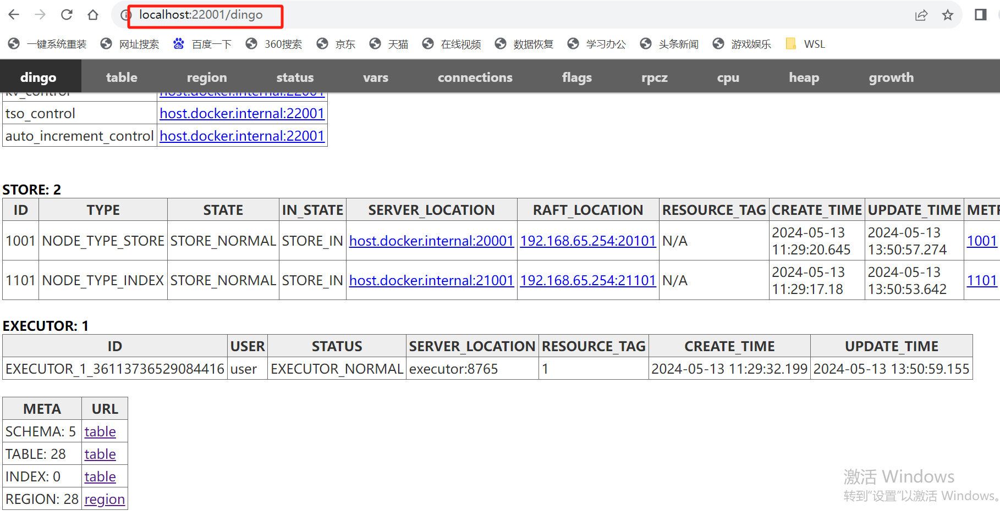

## Starting the DingoDB Journey

The following provides two ways to use it.

### DBeaver

#### 1. Create a connection
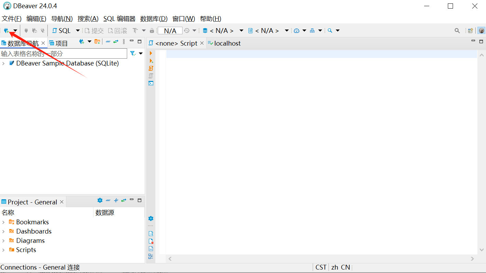

#### 2. Select the Mysql driver
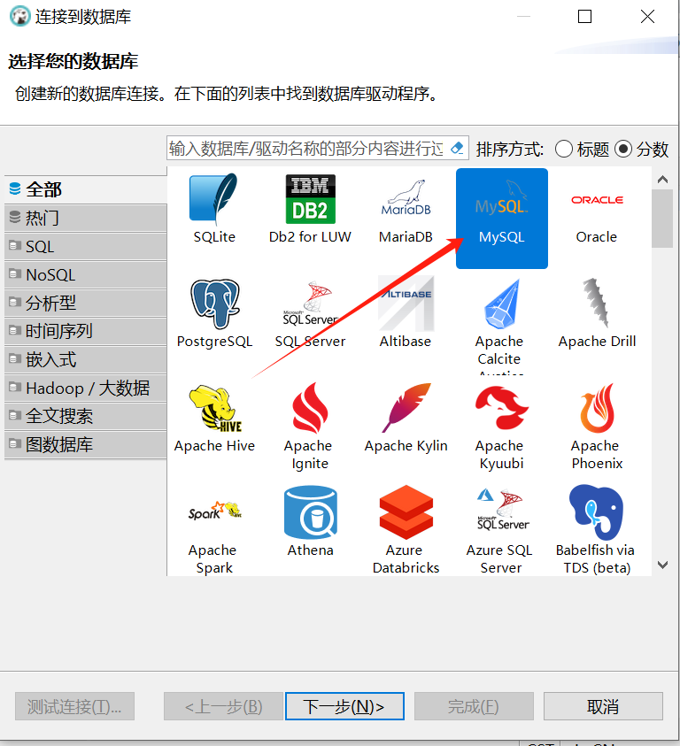

#### 3. Configure connection parameters
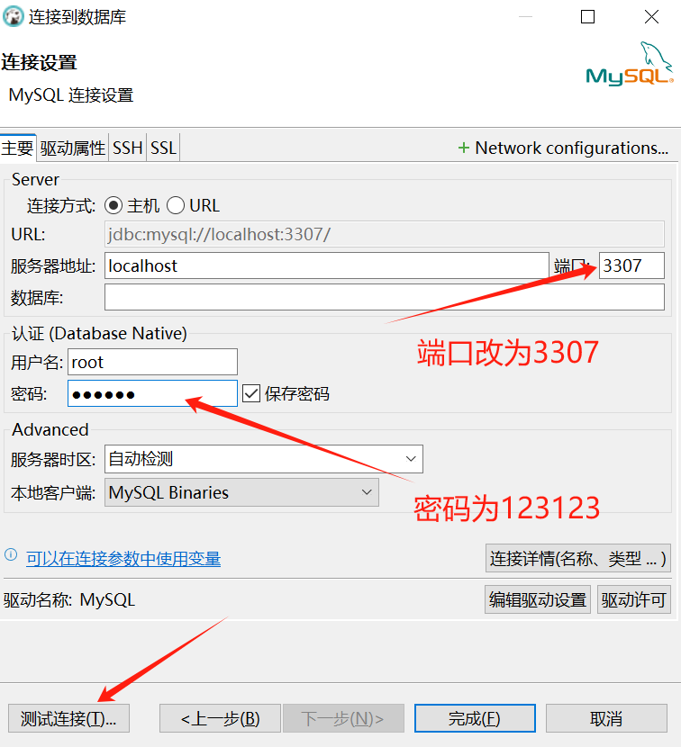

#### 4. Test the link
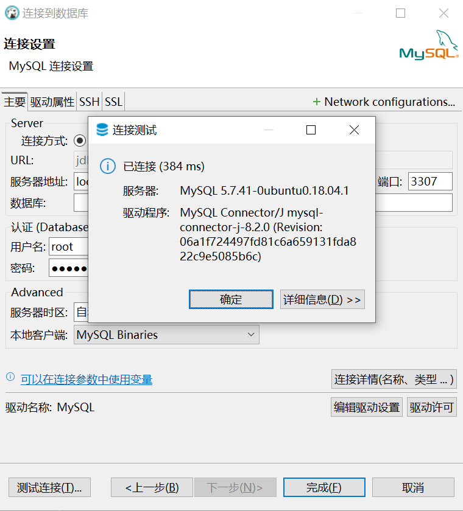

### Mysql client

#### 1. Install the Mysql client
```shell
 apt-get update
 apt-get install -y mysql-client
```
#### 2. Check the Mysql version,
recommended to use v8.0.36 or above
```shell
mysql --version
mysql Ver 8.0.36 for Linux on x86_64 (Source distribution)
```
#### 3. Connecting to DingoDB
Password defaults to *123123*.
```shell
mysql -h 127.0.0.1 -P 3307 -uroot -p ******
```