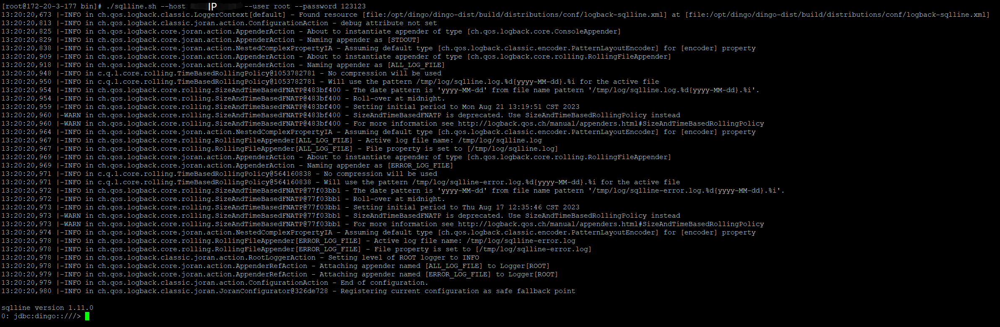
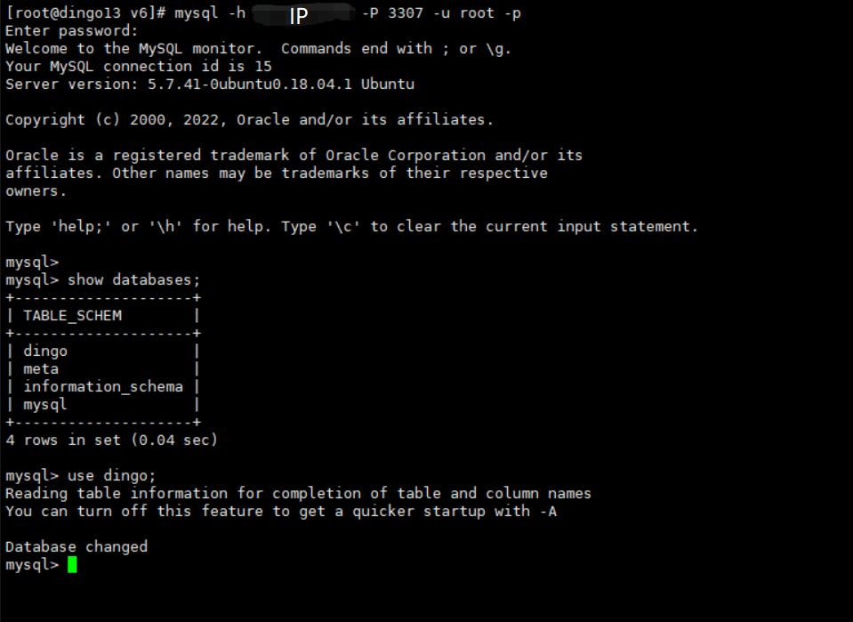

# How to Use DingoDB

We provide the following modes to access to DingoDB.

## JDBC Driver

In DingoDB cluster, A JDBC Driver proxy should be start, it will pass the SQL query to `Executor`.

```shell
./bin/start-executor.sh
```

The usage about SQL can be reference to [Play with DingoDB using SQL](./play_with_dingo_using_sql.md)


## Sqlline Mode

* DingoDB

    In DingoDB install path, you can start a sqlline to build connection to the cluster.

```shell
   ./bin/sqlline.sh host root
```


* MySQL

    In MySQL install path, you can start a sqlline to build connection to the cluster.
```shell
mysql -h ip -P 3307 -u root -p ******
```
