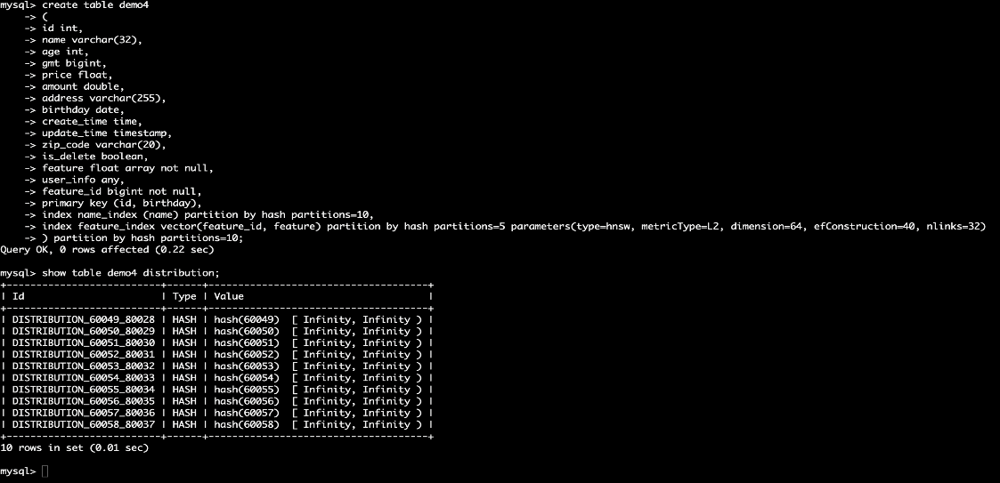
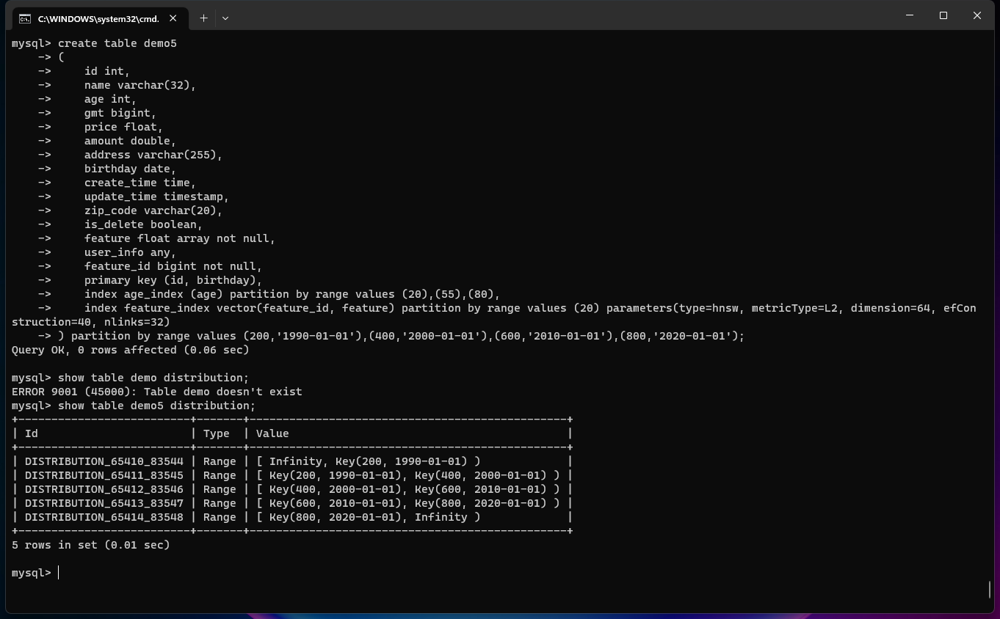

# DDL Commands
DDL statements are used to create database objects.
## 1. Table
### Parameter description
|parameter|description|details|syntax|
|:-:|:-|:-|:-|
|TableName|Table name|The name of the table to be created, which must be unique in the database and follow the naming convention. |Table table_name|
|Replica|Number of replicas|Sets the replica value. |Replica = {replica}|
|AutoIncrement|Self-Incrementing Fields|A field column can be specified as a self-incrementing column, currently only int type field columns are supported, and you can specify the self-incrementing column start value. |filed field_type auto_increment|
|Default|default_name|Specifies the default value for a column in the table. |Default default_name|
|Not null|Not null|Used to ensure that the value in a column cannot be null. not null must follow the end of the field in Dingo. |NOT NULL|
|Primary key|Primary key|Used to uniquely identify one or more columns for each row in a table. Primary key constraints enforce that the value of the column or combination of columns is unique in the table and cannot be NULL. in Dingo you cannot set a primary key directly after a field, you need to set the primary key on a separate line. |Priamry Key(field_name)|Partition by|Priamry Key(field_name)|Partition by
|Partition by|Range Partitioning|Partition by range; divide the data into different partitions according to the specified range. You can partition by range based on the values of one or more columns. |Partition by range values(1,100),(101,200);|
|Partition by|Hash Partitioning|Partition by Key's hash value; Partition by the hash value of a column or multiple columns. Each hash determines the partition to which the data belongs. |Partition by hash partitions={partitions}|
|Engine|Storage engine|When creating a table, you can specify the corresponding storage engine; Dingo provides two kinds of storage engine: LSM BTree, Txn_LSM, Txn_BTree; the system defaults to: Txn_LSM|Engine = {engine_name}|
|Index|vector index field|refers to creating an index on a vector field, you need to specify the index type Vector when creating the index.|INDEX [index_name] (vector) ({index_parameters}) [WITH ({columns})] (PARAMETERS) (vector_ parameters)|
|Index|scalar index field| refers to an index created on a scalar field. When creating an index, it is specified as a scalar index by default, and Scalar may or may not be written. |INDEX [index_name] (scalar) ({index_parameters}) [WITH ({columns})] (PARAMETERS) (vector_parameters)|

### Create Table

#### Syntax
```
CREATE TABLE [IF NOT EXISTS] table_name
(
    <col_name> <col_type> [ { DEFAULT <expr> }],
    <col_name> <col_type> [ { DEFAULT <expr> }],
    ...
)
```

#### Sample
```
dingo> CREATE TABLE test(id Int, name Varchar, address Varchar);

dingo> INSERT INTO test values(1,'xiaoming','shanghai');

dingo> select * from test;
+------+--------+---------+
| ID   | NAME   |ADDRESS  |
+------+--------+---------+
|  1   |xiaoming|shanghai |
+------+--------+---------+
```
### Drop Table
#### Syntax
```
DROP TABLE [IF EXISTS] name
```

#### Examples
```
dingo> CREATE TABLE test(id INT, name Varchar);
dingo> DROP TABLE test;
```

## 2. Index
### Creat IndexTable
#### Syntax
* Creates a table with Scalar Index

```
create table demo1 (
    id int,
    name varchar(32),
    age int,
    gmt bigint,
    price float,
    birthday date,
    create_time time,
    update_time timestamp,
    zip_code varchar(20),
    is_delete boolean,
    index name_index (name),
    PRIMARY KEY (id)
);
```
* Creates a table with Vector Index
```
create table demo2
(
    id bigint not null, 
    name varchar(32),
    age int,
    amount double,
    birthday date,
    feature float array not null,
    feature_id bigint not null,
    index feature_index vector(feature_id, feature) parameters(type=hnsw, metricType=L2, dimension=8, efConstruction=40, nlinks=32)
    primary key(id)
);
```


In `SQL`, the `feature` column is a vector column, and the type is a floating-point array. With vector columns need to add vector index, otherwise it will be treated as an ordinary array type, vector index in the definition and scalar index is similar to the corresponding definition of the method using `VECTOR`, the need for two parameters: one is the `id` column of the vector, at present only supports the integer type; the second is the vector column, at present only supports the floating-point type.

* Creates a table with Full-Text Index
```
CREATE TABLE test
(
       id bigint not null,
       feature float array not null, 
       feature_id bigint not null,
       description varchar not null,
       category varchar not null,
       rating bigint not null,
       text_id bigint not null,
       INDEX text_index TEXT(text_id, description, category, rating, text_id) engine=TXN_BTREE PARTITION BY RANGE values(10) parameters(text_fields='{"description": {"tokenizer": {"type": "stem"}}, "category": {"tokenizer": {"type": "stem"}}, "rating": {"tokenizer": {"type": "i64"}}, "text_id": {"tokenizer": {"type": "i64"}}'), # full-text index
       index feature_index vector(feature_id, feature) parameters(type=hnsw, metricType=L2, dimension=8, efConstruction=40, nlinks=32), # vector index
       primary key(id)
) engine=TXN_LSM;
```
`text_id` is required, full-text indexing unique identification `ID`, ID > 0, text_id can be `feature_id`, is if the `INT64` type can be, if you want to `text_id` index, you need to add a parameter with the same name in `TEXT ()`.
`description`, `category`, `rating` are the fields of full text index, only 4 types are allowed: `INT64`, `DOUBLE`, `STRING`, `BYTES`, the fields of full text index should include at least two fields, one of the two fields must be `text_id`.
Note: `text_fields` in `parameters` is the user fill in about the full-text index field of the word splitter parameters, must be full-text index fields are filled in.


### Drop Table

Deletes the table.

#### Syntax

```sql
DROP TABLE [IF EXISTS] name
```

#### Sample

```sql
dingo> CREATE TABLE test(id INT, name Varchar);
dingo> DROP TABLE test;
```
## 3. Partition

### Hash
#### Syntax
```sql
[ PARTITION BY
  HASH
  PARTITIONS={partitions} ]
```
#### Sample
```sql
PARTITION BY HASH PARTITIONS=10,
```
partitions represents the number of partitions;
#### Create Hash Partitioned Table
Create Hash partitioned table, support `scalar index partitioning + vector index partitioning + table partitioning`

```
create table demo4
(
id int,
name varchar(32),
age int,
gmt bigint,
price float,
amount double,
address varchar(255),
birthday date,
create_time time,
update_time timestamp,
zip_code varchar(20),
is_delete boolean,
feature float array not null,
user_info any,
feature_id bigint not null,
primary key (id, birthday),
index name_index (name) partition by hash partitions=10,
index feature_index vector(feature_id, feature) partition by hash partitions=5 parameters(type=hnsw, metricType=L2, dimension=64, efConstruction=40, nlinks=32)
) partition by hash partitions=10;
```
#### Viewing Partition Information
```
show table demo4 distribution;
```

### Range
#### Syntax
```sql
[ PARTITION BY
  RANGE 
  VALUES(( {partition_values} )*) )]
 ```
#### Sample
 ```
PARTITION BY RANGE VALUES (1,100),(2,100);
 ```


The value after "VALUES" indicates that there will be three partitions; The partition range is as follows:
- [Infinity, key(1,100));
- [key(1,100), key(2,100));
- [key(2,100), Infinity);
  
Infinity means infinite; on the left it means infinitely small, on the right it means infinitely large.

#### Create Range Partitioned Table
Create Range partitioned table, support `scalar index partitioning + vector index partitioning + table partitioning`
```
create table demo5
(
    id int,
    name varchar(32),
    age int,
    gmt bigint,
    price float,
    amount double,
    address varchar(255),
    birthday date,
    create_time time,
    update_time timestamp,
    zip_code varchar(20),
    is_delete boolean,
    feature float array not null,
    user_info any,
    feature_id bigint not null,
    primary key (id, birthday),
    index age_index (age) partition by range values (20),(55),(80),
    index feature_index vector(feature_id, feature) partition by range values (20) parameters(type=hnsw, metricType=L2, dimension=64, efConstruction=40, nlinks=32)
) partition by range values (200,'1990-01-01'),(400,'2000-01-01'),(600,'2010-01-01'),(800,'2020-01-01');
```
#### Viewing Partition Information
```
show table demo5 distribution;
```


## 4. Region
#### Region Split

#### Parameter Description
|parameter|details|
|:-:|:-|
|table_name|Table name|

#### Sample
```
Alter table tableName add distribution by values(10);
```
## 5. Online Schema Change
### Add Index
- Scalar Index
```
alter table t7 add index name_index(name,age,price);
```
- Vector Indexing
```
alter table t7 add index feature_index vector(feature_id,feature) engine=tnx_lsm parameters(type=hnsw,metricType=L2,dimension=32);
```
- Full-Text Index
```
alter table t7 add index TEXT_INDEX(`doc_id`,`doc`) with(name,age,feature) parameters(text_fields='{"doc":{"tokenizer":{"type":"default"}}}');
```
- Add index with overridden index fields
```
alter table t7 add index feature_index vector(feature_id,feature) with(name,price) parameters(type=hnsw,metricType=L2,dimension=32);
```
- Add index support for specifying the number of copies, and storage engine
```
alter table t7 add index feature_index vector(feature_id,feature) with(name,price) parameters(type=hnsw,metricType=L2,dimension=32) ENGINE=TXN_BTREE REPLICA=2;
```
- Add scalar indexes to support uniqueness constraints
```
alter table t7 add unique index name_index(name,age,price);
```
### Drop Index
- Syntax 1
```
alter table t7 drop index name_index;
```
- Syntax 2
```
drop index name_index on t7;
```
### Add Column
Currently only supports adding a single column
- Adding a specified column
```
alter table t3 add column price float;
```
- Specify default values when adding columns
```
alter table t3 add column age int default 88;
```
- Specify non-null when adding a column
```
alter table t3 add column age2 int NOT NULL;
```

### Drop Column
```
alter table t3 drop column name;
```