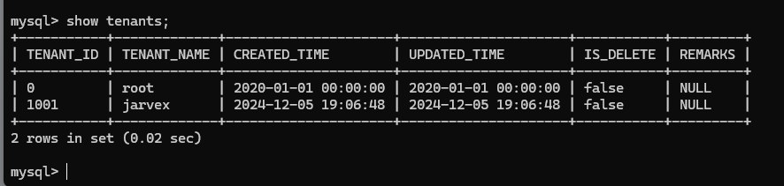
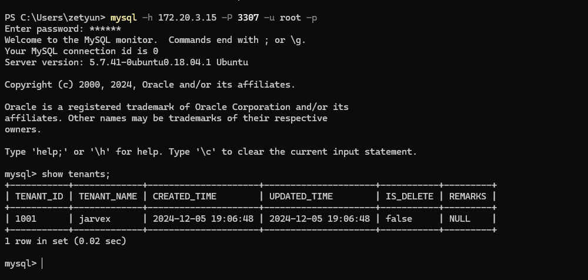
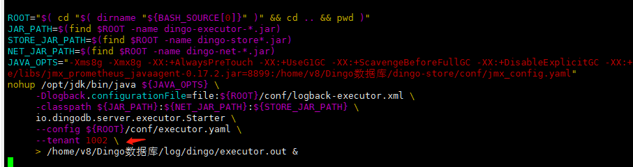
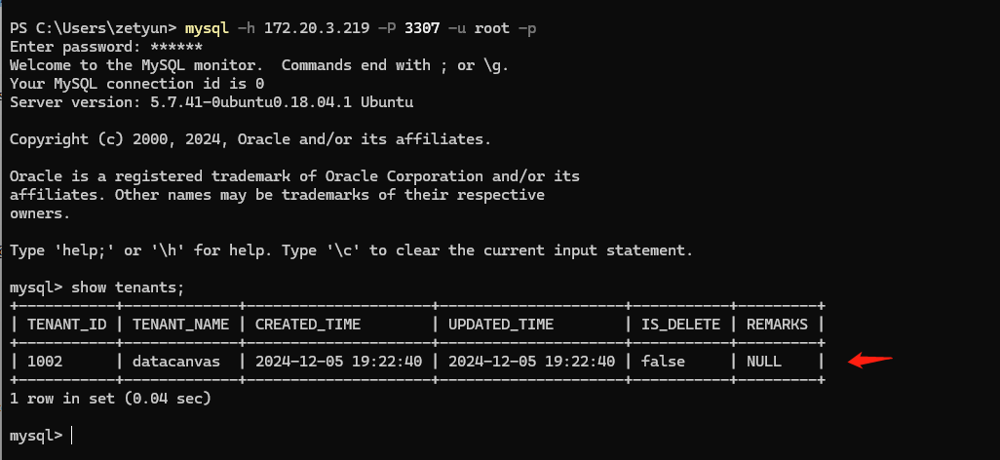
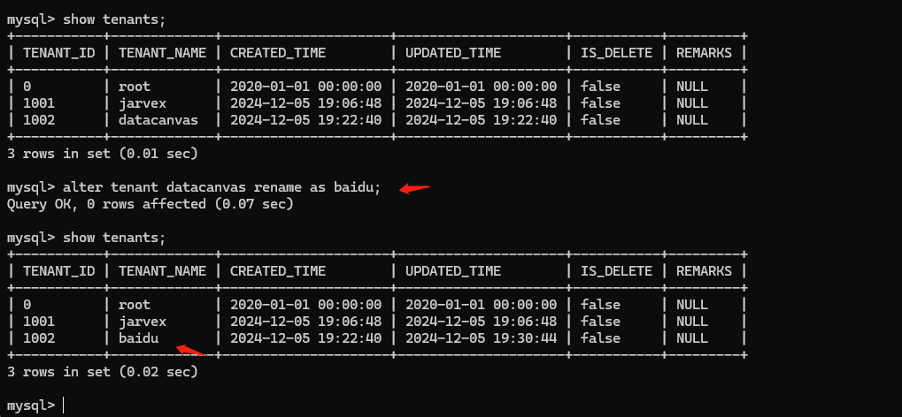
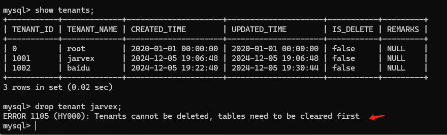
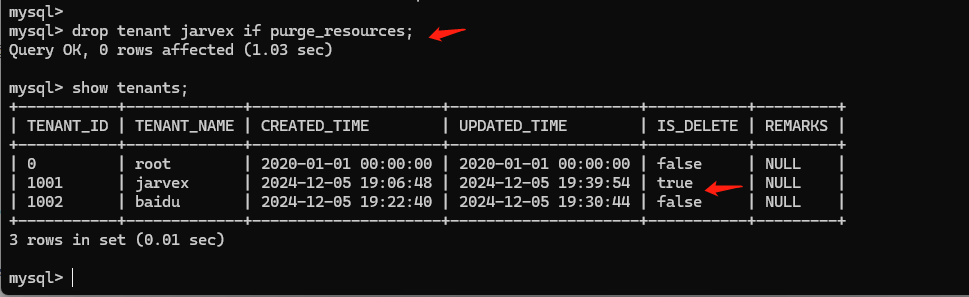
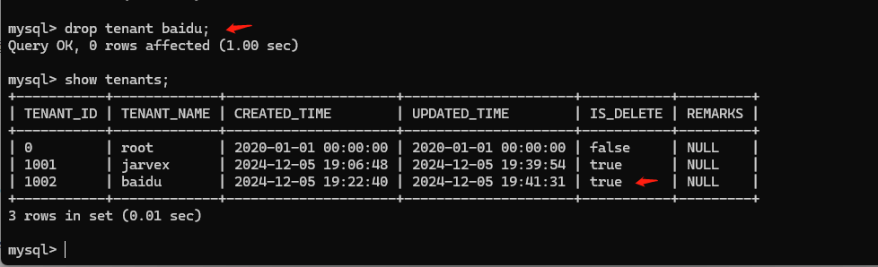

# Multi-Tenant

## 1. Create Tenants
```
create tenant jarvex;
```
## 2. View Tenants
```
show tenants;
```

## 3. Start Tenants
Executor is started using the created tenant.
> Note: When a regular tenant is created and starts Executor, it initializes all the same metadata tables as the root tenant, and connects to the regular tenant by logging in with the root user and the same default password.
#### Mode 1
Through the environment variables (can be system variables, user variables, or session temporary variables), here we take system variables as an example:
- Step 1: Edit the /etc/profile file to add system environment variables.
```
export tenant=1001
```
- Step 2: Save and exit and execute source /etc/profile
> If the current Executor is started through 0 tenant, restart the Executor, then connect to the Executor of that tenant, and check the tenants: non-0 tenant, show tenants only shows the current tenant itself. It means that the startup with normal tenant is successful.



#### Mode 2
- Step 1: Start by specifying the tenant parameter (specified in the start-executor.sh script) and again create a new tenant (1002)

- Step 2: Specify the tenant id in start-executor.sh: -tenant 1002 \ As follows:


- Step 3: Restart Executor and then connect to the address of that node to see that the current tenant is the specified tenant ID.
  

## 4. Update Tenants
Only the root tenant has the privilege to update the tenant. Operating from the shell command line only provides the ability to update the tenant name.
Execute the command:
```
alter tenant <old_name> rename as <new_name>;
```
After the update, you can see that the tenant name has been updated, UPDATE_TIME is the time at which the update was made, and the tenant ID remains unchanged.

## 5. Delete Tenants
Description:
- Only the root tenant has the privilege to delete tenants, and only ordinary tenants can be deleted, not the root tenant itself. 
- Deleting a tenant successfully, all metadata and user data under that tenant will be deleted. Therefore, please be careful when deleting tenants.
- For easy tracking of tenant history information, the deleted tenant will still be shown in the tenant list, IS_DELETE is shown as true
- Deleted tenant, start Executor will fail (i.e. tenant is no longer available)
- Shell command line to delete a tenant, only supports deletion by tenant name, not by tenant id.

> - If there is created data under the deleted tenant. Direct deletion is not allowed, if you need to delete, you need to use the purge_resources parameter.
> - If there is no new data table or schema created under the tenant, the tenant can be deleted directly.
> - If there is data under the tenant, direct deletion returns failure:
```
drop tenant <tenant_name>;
```

If there is data under the tenant, using the purge_resources parameter, it can be deleted successfully.
> Note: The deleted tenant will still be shown in the tenant list and the IS_DELETE field will become true
```
drop tenant <tenant_name> if purge_resources;
```

If no new data is created under the tenant, it can be deleted directly
