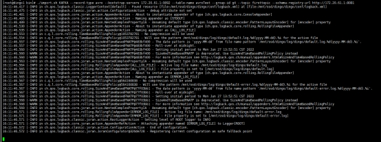
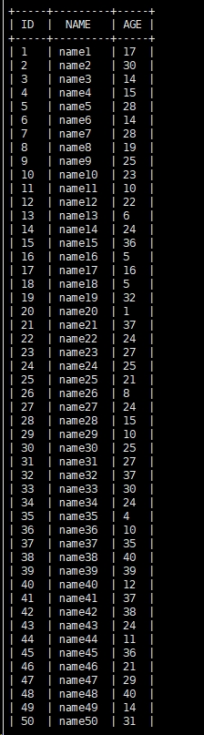

# Import data from Kafka

To make it easier for users to do analysis, DingoDB can import data from Apache Kafka in JSON, and Avro format.

## 1. Create Table

```shell
    create table avroTest(
        id int not null, 
        name varchar(32), 
        age int, 
        primary key(id)
    );
```

## 2. Import Data

The format of data can be JSON or AVRO format. Now we choose AVRO as an example. In AVRO mode, [Schema-Registry](https://docs.confluent.io/platform/current/schema-registry/index.html) is needed as it's a meta storage of data schema in Kafka.

- Prepare data

Related operations are omitted here, please refer to [Confluent Kafka](https://developer.confluent.io/quickstart/kafka-on-confluent-cloud/)

- Import Data


```shell
./import.sh KAFKA --record-type avro --bootstrap-servers 172.20.61.1:9092 --table-name avroTest --group-id g4 --topic firsttopic --schema-registry-url <http://172.20.61.1:8081>
```

The arguments about import command are as follows:

- bootstrap-servers: Kafka broker list
- table-name: the dest table in dingo
- group-id: the consumer group
- topic: the source topic of Kafka
- schema-registry-url: the address of the schema registry



> the `import.sh` can be found in `dingo.zip`


## 3. Check Result


