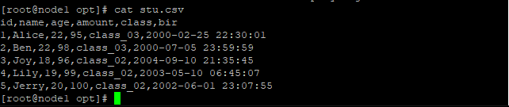
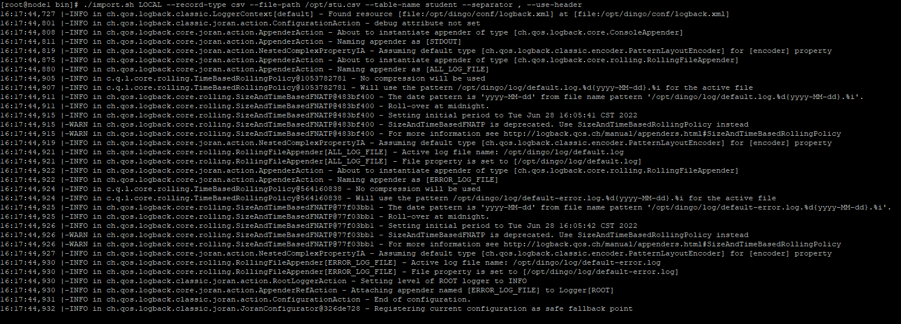
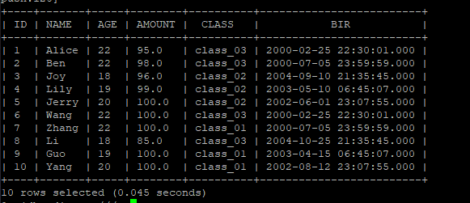

# Import data from Local files

To make it easier for users to do analysis, DingoDB can import local files in CSV or JSON format to DingoDB directly.

## 1. Create Table

```shell
    create table student (
       id int,
       name varchar(32) not null,
       age int,
       amount double NOT null,
       class varchar(255),
       birth timestamp,
       primary key(id)
    );
```

## 2. Import Data

The content of files can be in CSV or JSON format. In CSV mode, the content of input files can either have a column header or not. Now we choose CSV with a header as an example.

- Prepare data in CSV format with header



- Import Data


```shell
./import.sh LOCAL --record-type csv --file-path /opt/stu.csv --table-name student --separator , --use-header
```

The arguments about import command are as follows:

- record-type: content format, such as CSV, JSON
- file-path: the source file
- table-name: the dest table in dingo
- separator: separator between columns
- use-header: content with header



> the `import.sh` can be found in `dingo.zip`


## 3. Check Result

