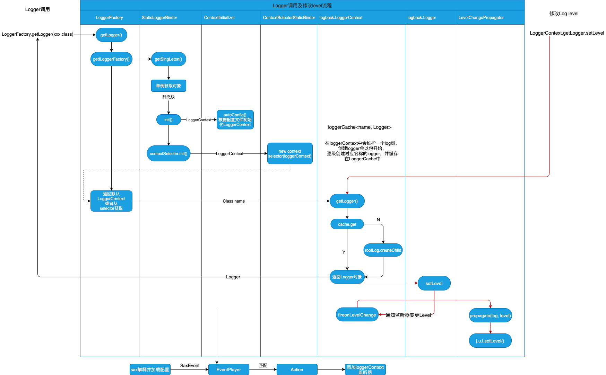

# Dynamically adjust log level

## Example of use

```shell
./bin/tool.sh --class io.dingodb.net.netty.connection.impl.NetServiceNettyConnection --level debug --serverHost 172.20.3.21 --serverPort 19191 
```

### Parameter Description

1. --class
```text
    To adjust the class name of the log level, the class name must be the full path.
```

2. --level
```text
    log level name.
```

3. --serverHost
```text
    The service node address of the class whose log level is to be adjusted.
```

4. --serverPort
```text
    The service port of the class whose log level is to be adjusted.
```

## Call process

When LoggerFactory.getLogger(XXX.class), slf4j delegates the StaticLoggerBinder class of the specific log implementation framework to return an ILoggerFactory, in which the LoggerContext is initialized according to the configuration file (logback.LoggerContext implement ILoggerFactory)Used to connect to slf4j,
the context will be added to the contextListener during initialization, and the getLogger method is specifically implemented in the LoggerContext, which maintains a loggerCache to save the created Logger object instance.
When adjusting the log level, the contextListener is notified to change the level of a logger, and the change is propagated to the equivalent logger in j.u.l



