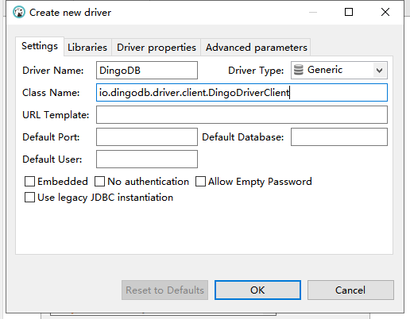

# How to Use DingoDB

## JDBC Driver

### Start Driver Proxy

In DingoDB cluster, A JDBC Driver proxy should be start, it will pass the SQL query to `Coordinator` or `Executor`.

```shell
./bin/start-driver.sh
```

### Connect using dbeaver

#### Setup Connection

- add driver configuration


- import driver class

 

#### Do Operation using Editor

You can use dbeaver to view tables and queries.


### Connect using Java

#### Setup Connection

After starting the server, you can connect to the dingodb database:

```Java
Class.forName("io.dingodb.driver.client.DingoDriverClient");
Connection connection = DriverManager.getConnection("jdbc:dingo:thin:url=ip:8765");
```

```jdbc:dingo:thin:url=172.20.3.200:8765``` is the connection string.

**The IP address should be the actual server IP address, and the default port is 8765.**

#### Do Operation using Java

- Create table

```java
Statement statement = connection.createStatement();
String sql = "create table exampleTest ("
            + "id int,"
            + "name varchar(32) not null,"
            + "age int,"
            + "amount double,"
            + "primary key(id)"
            + ")";
statement.execute(sql);
```

- Insert data to table

```java
Statement statement = connection.createStatement();
String sql = "insert into exampleTest values (1, 'example001', 19, 11.0)";
int count = statement.executeUpdate(sql);
```

- Query data from table

```java
Statement statement = connection.createStatement();
String sql = "select * from exampleTest";
try (ResultSet resultSet = statement.executeQuery(sql)) {
  while (resultSet.next()) {
    // iterator the result set
	}
}
```


## Sqlline Mode

In DingoDB install path, you can start a sqlline to build connection to the cluster.

```shell
   ./bin/sqlline.sh
```
