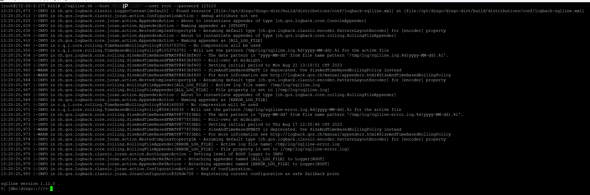

# How to Use DingoDB

DingoDB is a real-time Hybrid Serving & Analytical Processing (HSAP) Database. It provide three ways to access to DingoDB.

## JDBC Driver

In DingoDB cluster, A JDBC Driver proxy should be start, it will pass the SQL query to `Executor`.

```shell
./bin/start-executor.sh
```

The usage about SQL can be reference to [Play with DingoDB using SQL](./play_with_dingo_using_sql.md)


## Sqlline Mode

* DingoDB

    In DingoDB install path, you can start a sqlline to build connection to the cluster.

```shell
   ./bin/sqlline.sh host root
```


* MySQL

    In MySQL install path, you can start a sqlline to build connection to the cluster.
```shell
mysql -h ip -P 3307 -u root -p ******
```


## Using Key-Value SDK

DingoDB is a distributed real-time multi-modal database. It combines the features of a data lake and a vector database. It can store any type of data (key-value, PDF, audio, video, etc) with data of any size.Using it, you can build your Vector Ocean (The Next Generation data architecture following data warehouse and data lake initiated by DataCanvas) and analyze structured and unstructured data with extremely low latency.
* Java SDK

  The detail about the SDK client can be found in [Play with dingo using Java SDK](./play_with_dingo_using_dingoclient.md).
* Python SDK

  The detail about the SDK client can be found in [Play with dingo using Python SDK](./play_with_dingo_using_Langchain.md).
