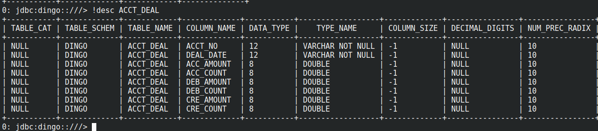

# Play with DingoDB using SDK

## Introducation

DingoDB is hybird Serving & Analytical Processing (HSAP) Database. In order to be more faster, it presents a Java API which is comprehensive and powerful to do operations on the database, such as DDL or DML operation.

## Operation using SDK

### Dependence about SDK

`dingo-sdk` artifactory can be download from maven central using pom directly.

```java
<dependency>
  <groupId>io.dingodb</groupId>
  <artifactId>dingo-sdk</artifactId>
  <version>0.4.0-SNAPSHOT</version>
</dependency>
```

### Function about dingo-sdk

1. Basic Key-Value Operation
    1. Get 
    2. Put
    3. Update
    4. Table Operation

2. Numerical operations
   1. Add
   2. Sum
   3. Max
   4. Min
   5. Count

3. Collection operations
   1. Baisc Operation
      1. size
      2. get_all
      3. clear
   2. Array
      1. get_by_index
      2. get_by_index_range
      3. set
      4. remove_by_index
      5. get_by_value
      6. remove_by_value
   3. Map
      1. put
      2. remove_by_key
      3. get_by_key
      
4. Filter
   1. DateRange
   2. NumberRange
   3. StringRange
   4. ValueEquals

**Function about Dingo API**: [API Documents](https://github.com/dingodb/dingo)

## Examples about dingo-sdk

### Step 1. Create Table

- Define table Using Pojo

```java
import io.dingodb.sdk.annotation.DingoKey;
import io.dingodb.sdk.annotation.DingoRecord;
import lombok.Getter;
import lombok.Setter;
import lombok.ToString;

@DingoRecord(table = "acct_deal")
@Getter
@Setter
@ToString
public class AcctDeal {
    @DingoKey
    private String acct_no;
    @DingoKey
    private String deal_date;

    private double acc_amount;
    private double acc_count;
    private double deb_amount;
    private double deb_count;
    private double cre_amount;
    private double cre_count;
}
```

- Create table Using SDK

```java
   String remoteHost = "coordinator:19181";
   DingoClient dingoClient = new DingoClient(remoteHost);
   dingoClient.open();

   DingoOpCli dingoOpCli = new DingoOpCli.Builder(dingoClient).build();
   boolean isOK = dingoOpCli.createTable(AcctDeal.class);
   System.out.println("Create table Status: " + isOK);
```

- Insert records to table

```java
   AcctDeal acctDeal = new AcctDeal();
   acctDeal.setAcct_no("1001");
   acctDeal.setDeal_date("2022-08-08");
   acctDeal.setAcc_amount(100);
   acctDeal.setAcc_count(10);
   acctDeal.setDeb_amount(50);
   acctDeal.setDeb_count(3);
   acctDeal.setCre_amount(30);
   acctDeal.setCre_count(3);
   dingoOpCli.save(acctDeal);
```

- Sample Data of Table

```sql
jdbc:dingo::///> select * from acc_deal limit 5;
+--------+------------+------------+-----------+------------+-----------+------------+-----------+
| ACC_NO | DEAL_DATE  | ACC_AMOUNT | ACC_COUNT | DEB_AMOUNT | DEB_COUNT | CRE_AMOUNT | CRE_COUNT |
+--------+------------+------------+-----------+------------+-----------+------------+-----------+
| 1001   | 2022-08-08 | 100        | 5         | 50         | 2         | 20         | 2         |
| 1002   | 2022-08-09 | 150        | 6         | 60         | 3         | 30         | 3         |
| 1001   | 2022-08-15 | 200        | 6         | 50         | 4         | 40         | 2         |
| 1004   | 2022-08-20 | 140        | 4         | 55         | 3         | 70         | 2         |
| 1001   | 2022-08-25 | 180        | 8         | 60         | 3         | 80         | 4         |
+--------+------------+------------+-----------+------------+-----------+------------+-----------+
```
```text
ACCO_NO: Account No--> primary key
DEAL_DATE: Deal Date--> primary key
ACC_AMOUNT: Trade amount about account
ACC_COUNT: Trade count about account
DEB_AMOUNT: Amount of debit
DEB_COUNT: Count of debit
CRE_AMOUNT: Amount of lender
CRE_COUNT: Count of lender
```

- View Table Structure using SQL




### Step 2. Do operation using sdk client

```java
    // Set Key Range
    Key startPrimaryKey = new Key(tableName, ImmutableList.of(Value.get(1001), Value.get(new java.sql.Date(1658937600000L))));
    Key endPrimaryKey = new Key(tableName, ImmutableList.of(Value.get(1001), Value.get(new java.sql.Date(1664294400000L)))); 
    
    // acc_amount + 100, 
    // acc_count + 1, 
    // cre_amount + 20, 
    // cre_count + 1
    boolean isSuccess = dingoClient.add(
        startPrimaryKey,
        endPrimaryKey,
        new Column("acc_amount", 100), new Column("acc_count", 1), new Column("cre_amount", 20), new Column("cre_count", 1));
    
    // calculate the sum of acct_amount when acct_no = 1001
    List<DingoExecResult> results = dingoClient.sum(
        startPrimaryKey,
        endPrimaryKey,
        new Column("acc_amount"));
        
    // Filter
    DingoFilter root = new DingoLogicalExpressFilter();
    DingoNumberRangeFilter numberRangeFilter = new DingoNumberRangeFilter(2, 100, 300);
    root.addAndFilter(numberRangeFilter);
    
    // calculate the sum(acc_amount) where acc_amount >= 100 && acc_amount <= 200 and acct_no = 1001 
    dingoClient.sum(
        startPrimaryKey,
        endPrimaryKey,
        root,
        new Column("acc_amount"));
    // result: 280
        
    ------------------------------------- collection -----------------------------
    
    // data: [1, 4, 7, 3, 9, 26, 11]
    Operation indexRange = ListOperation.getByIndexRange(1, 3, new Column("list_data_column"));
    List<DingoExecResult> results = dingoClient.operate(
        startKey,
        endKey,
        ImmutableList.of(indexRange));
    // result: [4, 7, 3]
    
    // data: {n1=10, n2=20}
    Operation put = MapOperation.put(Value.get("n3"), Value.get("30"), new Column("map_data_column"));
    dingoClient.operate(
        startKey,
        endKey,
        ImmutableList.of(put));
    // table data: {n1=10, n2=20, n3=30}
```

### Step 3. Drop table and close connection

```java
   isOK = dingoOpCli.dropTable(AcctDeal.class);
   System.out.println("drop table Status:" + isOK + ".............");

   dingoClient.close();
```

## Operation using Annotation

DingoDB presents a Java API which is comprehensive and powerful, but requires a measure of boiler plate code to map the data from Java POJOs to the database. The Annotation is aim to lower the amount of code required when mapping POJOs to DingoDB and back as well as reducing some of the brittleness of the code.

### Keys

The key to an DingoDB record can be specified either as a field or a property. Remember that DingoDB keys can be Strings, numberical types and date types only.

To use a field as the key, simply mark the field with the DingoKey annotation:

```java
    @DingoKey
    private String acct_no;
    @DingoKey
    private String deal_date;
```

### Column

Fields in Java can be mapped to the database irrespective of the visibility of the column. To do so, simply specify the column to map to with the @DingoColumn annotation:

```java
@DingoColumn(name = "vrsn")
private int version;
```

This will map the contents of the `version` field to a `vrsn` column in DingoDB.

If the name of the column matches the name of the field in Java, the name can be omitted:

```Java
@DingoColumn
private int age;
```

This will appear in DingoDB as the `age` column.

By default, all fields will be mapped to the database. Fields can be excluded with the @DingoExclude annotation, and renamed with the @DingoColumn annotation. For example:

```Java
@DingoRecord(table = "testSet")
public static class Test {
	public int a;
	public int b;
	public int c;
	public int d;
}
```
This saves the record with 4 columns, `a`,`b`,`c`,`d`. To save only fields `a`,`b`,`c` you can do either:

```Java
@DingoRecord(table = "testSet")
public static class Test {
	public int a;
	public int b;
	public int c;
	@DingoExclude
	public int d;
}
```

If a field is marked with both @DingoExclude, the column will not be mapped to the database.

You can force the name of a particular column or columns by specifying them in an DingoColumn:

```Java
@DingoRecord(table = "testSet")
public static class Test {
	public int a;
	public int b;
	@DingoColumn(name = "longCname")
	public int c;
	public int d;
}
```

This will save 4 fields in the database, `a`, `b`, `longCname`, `d`.


