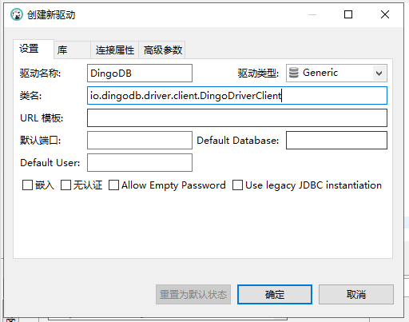
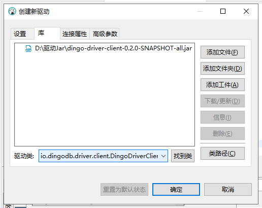
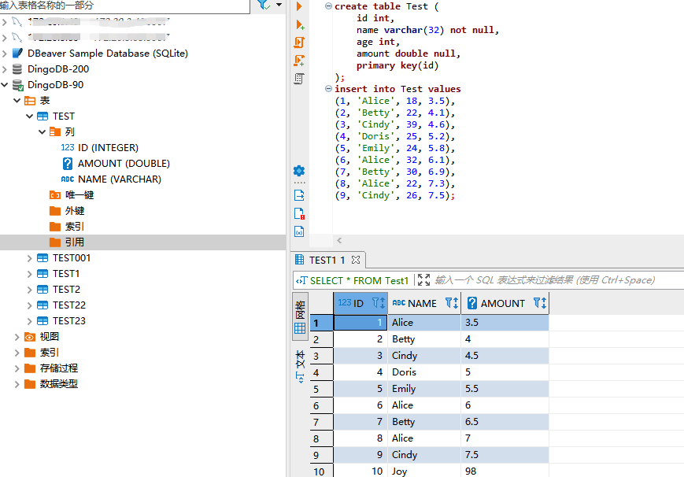

# Play with DingoDB using SQL

## Play DingoDB with SQL Tools

### Setup Connection to DingoDB 

- add driver configuration



- import driver class

 

### Do Operation using Editor

You can use dbeaver to view tables and queries.



- Create Table

```sql
create table userinfo (
    id int,
    name varchar(32) not null,
    age int,
    amount double,
    primary key(id)
);
```

- Insert values to Table

```sql
insert into userinfo values
(1, 'Alice', 18, 3.5),
(2, 'Betty', 22, 4.1),
(3, 'Cindy', 39, 4.6),
(4, 'Doris', 25, 5.2),
(5, 'Emily', 24, 5.8),
(6, 'Alice', 32, 6.1),
(7, 'Betty', 30, 6.9),
(8, 'Alice', 22, 7.3),
(9, 'Cindy', 26, 7.5);
```

- Execute Query

1. Query table by condition

```sql
select * from userinfo where id=3;
```

2. Query table by aggregation condition

```sql
select name, sum(amount) as sumAmount from userinfo group by name;
```

3. Query table by `order by`

```sql
select * from userinfo order by id;
```

4. Update table by row or condition

```sql
update userinfo set age = age + 10;
update userinfo set age = age + 10 where id = 1;
```

## Play DingoDB Using Java Code

### Setup Connection

After starting the server, you can connect to the dingodb database:

```Java
Class.forName("io.dingodb.driver.client.DingoDriverClient");
Connection connection = DriverManager.getConnection("jdbc:dingo:thin:url=ip:8765");
```

```jdbc:dingo:thin:url=172.20.3.200:8765``` is the connection string.

**The IP address should be the actual server IP address, and the default port is 8765.**

### Do Operation using Java

- Create table

```java
Statement statement = connection.createStatement();
String sql = "create table exampleTest ("
            + "id int,"
            + "name varchar(32) not null,"
            + "age int,"
            + "amount double,"
            + "primary key(id)"
            + ")";
statement.execute(sql);
```

- Insert data to table

```java
Statement statement = connection.createStatement();
String sql = "insert into exampleTest values (1, 'example001', 19, 11.0)";
int count = statement.executeUpdate(sql);
```

- Query data from table

```java
Statement statement = connection.createStatement();
String sql = "select * from exampleTest";
try (ResultSet resultSet = statement.executeQuery(sql)) {
  while (resultSet.next()) {
    // iterator the result set
	}
}
```