# 快速入门

## 1、安装WSL
### 1）先决条件
想要成功在Windows 10+ 上运行WSL 2，需要先满足以下硬件条件：

> * 具有二级地址转化（SLAT）的64位处理器；
> * 4GB系统RAM；
> * 在BIOS中启用硬件虚拟化;

### 2）下载安装WSL

在管理员模式下打开 PowerShell 或 Windows 命令提示符，方法是右键单击并选择“以管理员身份运行”，输入 wsl --install 命令，安装完成后重启计算机。此命令将启用运行 WSL 并安装 Linux 的 Ubuntu 发行版所需的功能。

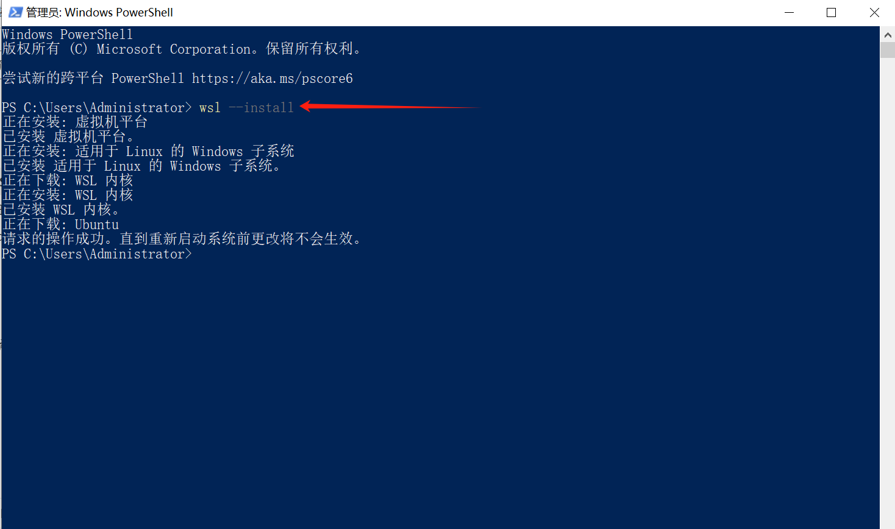

### 3）重启电脑
  
重启计算机后会自动安装Linux子系统（默认是Ubuntu）。

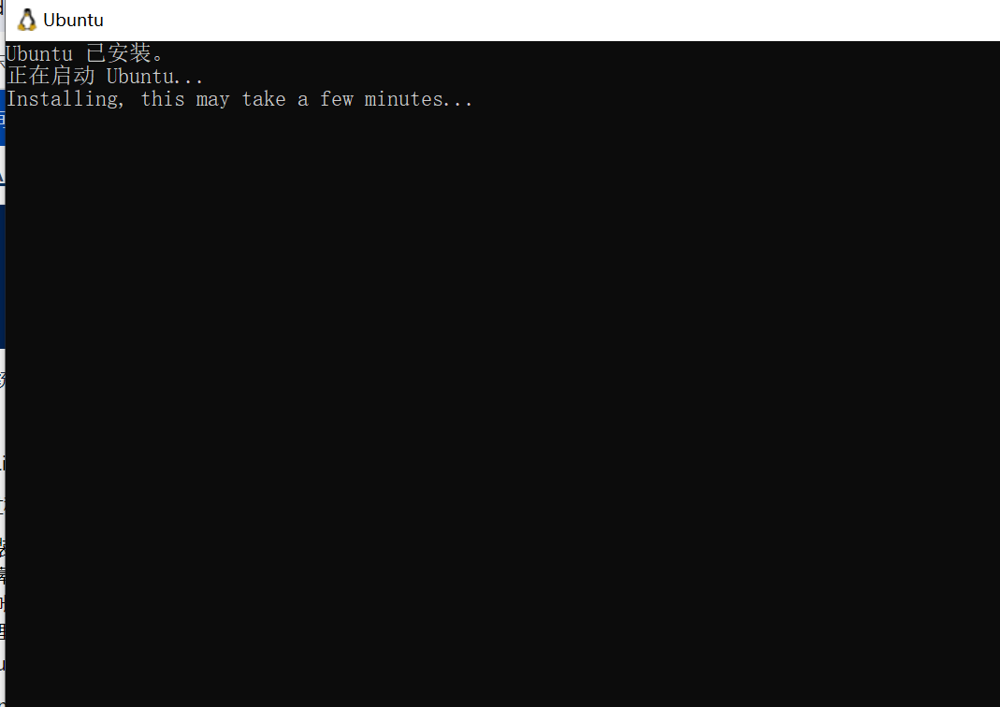

### 4）检查系统配置

在控制面板->程序→启用或关闭 Windows 功能中检查是否勾选适用于 Linux 的 Windows 子系统和虚拟机平台。

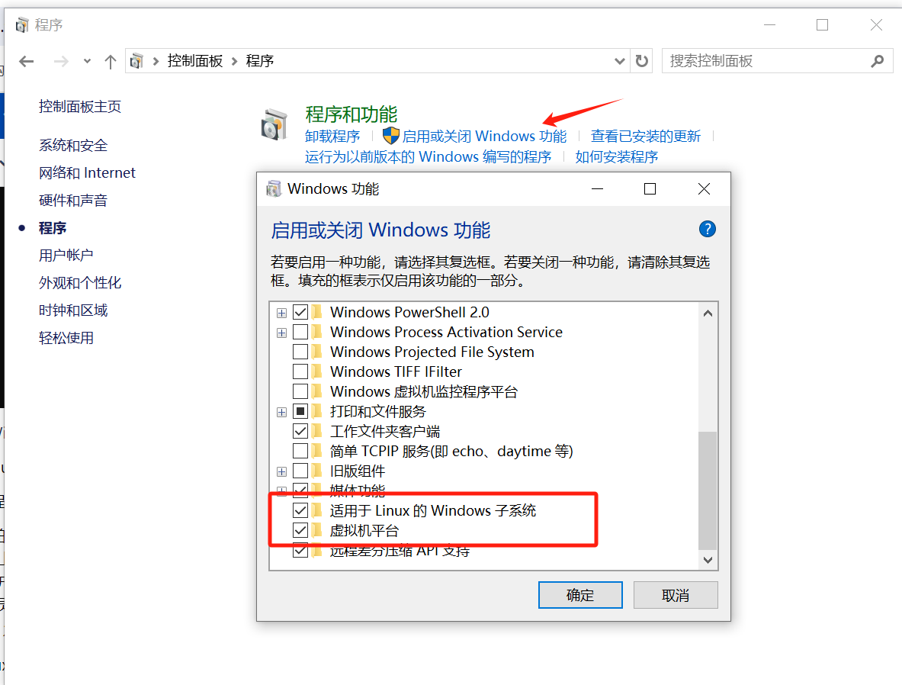

### 5）设置用户名和密码

安装 WSL 后，需要为新安装的 Linux 发行版创建用户帐户和密码。点击 “开始” 菜单打开Linux发行版（默认情况下为 Ubuntu）。 此时，系统将要求你为 Linux 发行版创建“用户名”和“密码”。
需要注意的是：
> * 此用户名和密码特定于安装的每个单独的 Linux 分发版，与 Windows 用户名无关。
> * 输入密码时，屏幕上不会显示任何内容。 这称为盲人键入。 你不会看到你正在键入的内容，这是完全正常的。
> * 创建用户名和密码后，该帐户将是分发版的默认用户，并将在启动时自动登录。
> * 此帐户将被视为 Linux 管理员，能够运行 sudo (Super User Do) 管理命令。
> * 在 WSL 上运行的每个 Linux 发行版都有其自己的 Linux 用户帐户和密码。 每当添加分发版、重新安装或重置时，都必须配置一个 Linux 用户帐户。

若要更改或重置密码，请打开 Linux 发行版并输入命令：passwd。 系统会要求你输入当前密码，然后要求输入新密码，之后再确认新密码。

#### _**忘记密码**_

a. 请打开 PowerShell，并使用以下命令进入默认 WSL 分发版的根目录：wsl -u root

> 如果需要在非默认分发版中更新忘记的密码，请使用命令：wsl -d Debian -u root，并将 Debian 替换为目标分发版的名称。

b. 在 PowerShell 内的根级别打开 WSL 发行版后，可使用此命令更新密码：passwd <username>，其中 <username> 是发行版中帐户的用户名，而你忘记了它的密码。

c. 系统将提示你输入新的 UNIX 密码，然后确认该密码。 在被告知密码已成功更新后，请使用以下命令在 PowerShell 内关闭 WSL：exit。

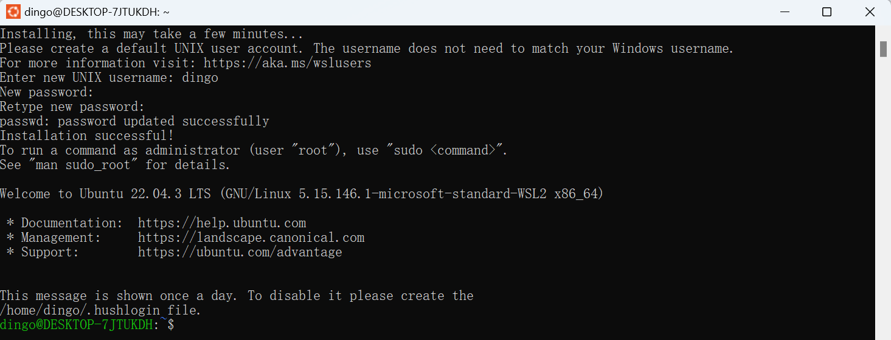

### 6）检查WSL版本

在 PowerShell 或 Windows 命令提示符中输入以下命令来检查每个发行版的 WSL 版本，默认是 WSL 2。

> `wsl -l -v`

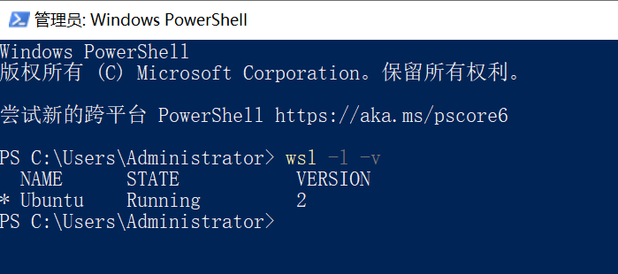

## 2、安装Docker DeskTop

### 1）先决条件
> * WSL version 1.1.3.0 或者更高版本。
> * Windows 11 64位：家庭版、专业版、企业版、教育版需要21H2或更高版本。
> * Windows 10 64bit:
>     - 推家使用家庭版、专业版、企业版、教育版需要22H2（版本 19045）或更高版本。
>     - 最低要求为家庭版、专业版、企业版、教育版需要21H2（版本 19044）或更高版本。
> * 在 Windows 上启用 WSL 2 功能

### 2）下载安装Docker DeskTop

[Docker DeskTop下载](https://desktop.docker.com/win/main/amd64/Docker%20Desktop%20Installer.exe?_gl=1*154qt9t*_ga*MTAyNTc0ODM4My4xNzE1MTUxNTE4*_ga_XJWPQMJYHQ*MTcxNTIzNDg5NC4zLjAuMTcxNTIzNDg5NC42MC4wLjA)

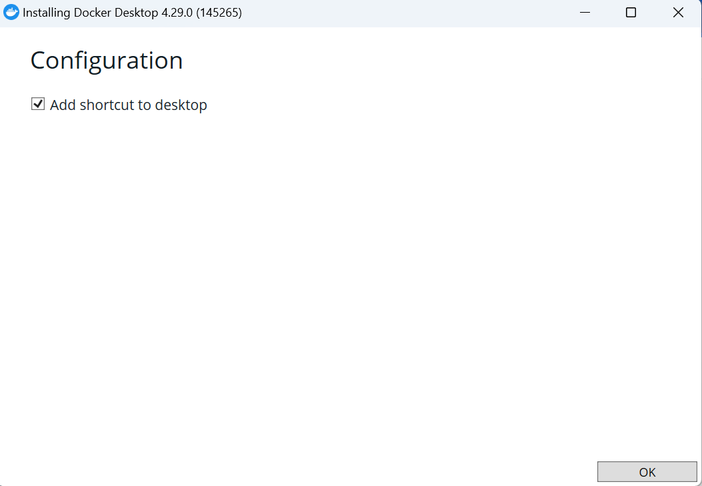

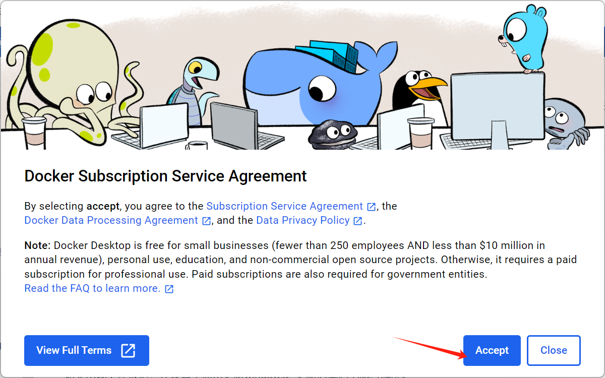

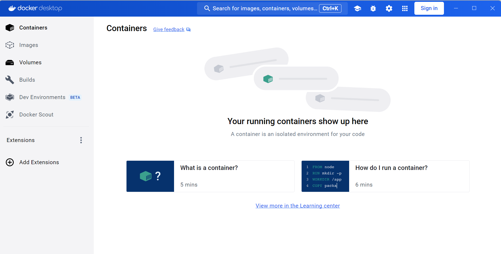

### 3）启动Docker DeskTop

安装完成。在启动Docker Desktop过程中，如果出现下述报错，可以在 Windows 设置中点击更新 Windows，更新后重启电脑可解决。

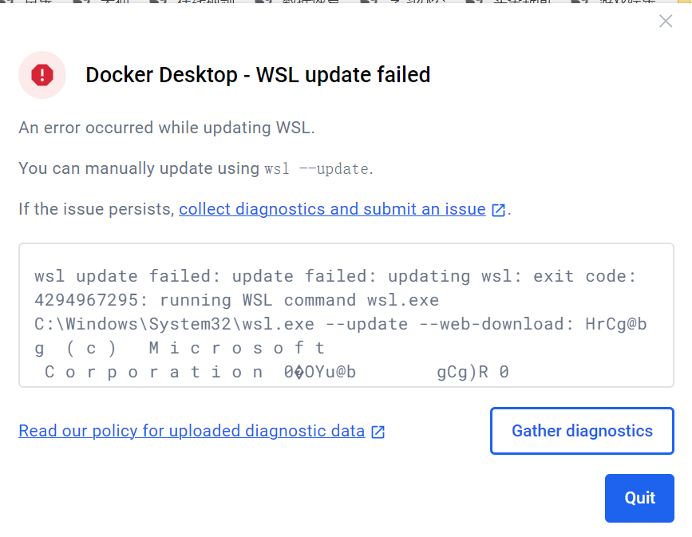

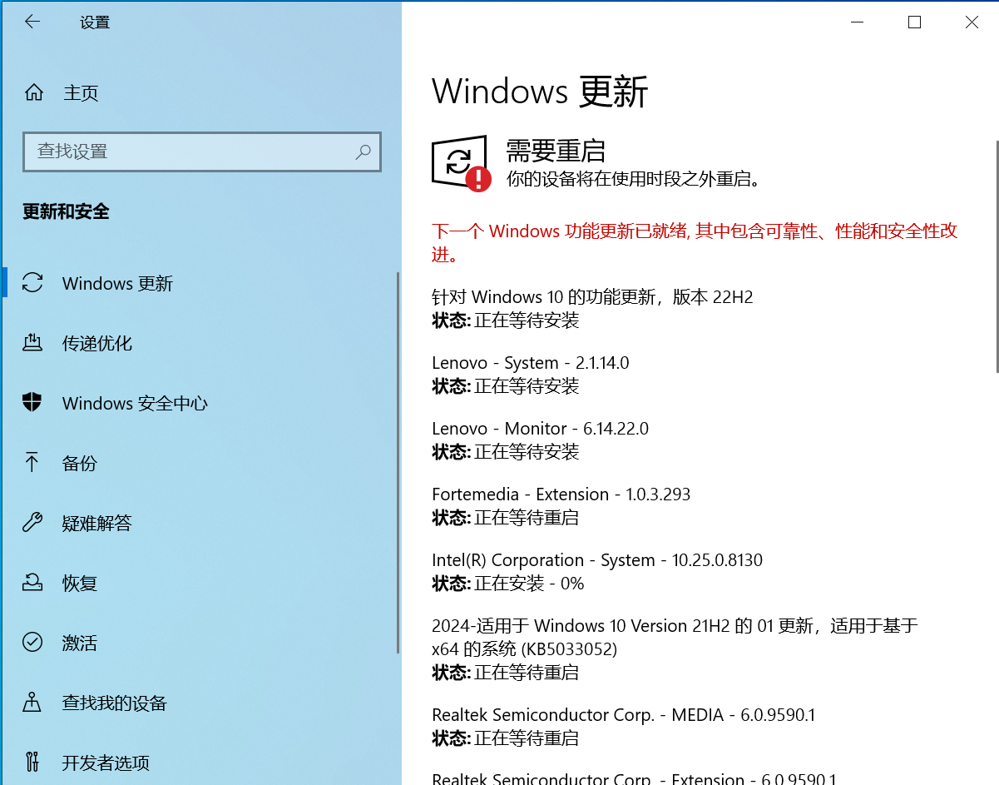

_**特别注意**_

Docker desktop 和Ubuntu里的 docker不同不同，他有一套特殊的工作机制：它会在 wsl2 里面加载一个块设备，然后直接用这个块设备里面的全套 docker 环境，包括 docker 命令、docker proxy、docker image 目录。ubuntu 里面不要安装 docker，完全使用 docker desktop。

## 3、Docker部署单机版DingoDB

### 1）创建配置文件docker-compose.lite.yml

在 Windows 目录下新建文件 docker-compose.lite.yml
    ---
    
    x-shared-environment: &shared-env
    SERVER_LISTEN_HOST: 0.0.0.0
    SERVER_HOST: host.docker.internal
    RAFT_LISTEN_HOST: 0.0.0.0
    RAFT_HOST: host.docker.internal
    COOR_RAFT_PEERS: host.docker.internal:22101
    COOR_SRV_PEERS: host.docker.internal:22001
    DEFAULT_REPLICA_NUM: 1
    DINGODB_ENABLE_LITE: 1
    
    services:
    coordinator1:
        image: dingodatabase/dingo-store:latest
        hostname: coordinator1
        container_name: coordinator1
        ports:
        - 22001:22001
        - 22101:22101
        - 28001:8000
        # network_mode: host
        networks:
        - dingo_net
        environment:
        FLAGS_role: coordinator
        COORDINATOR_SERVER_START_PORT: 22001
        COORDINATOR_RAFT_START_PORT: 22101
        INSTANCE_START_ID: 1001
        <<: *shared-env
    
    store1:
        image: dingodatabase/dingo-store:latest
        hostname: store1
        container_name: store1
        ports:
        - 20001:20001
        - 20101:20101
        # network_mode: host
        networks:
        - dingo_net
        depends_on:
        - coordinator1
        environment:
        FLAGS_role: store
        RAFT_START_PORT: 20101
        SERVER_START_PORT: 20001
        INSTANCE_START_ID: 1001
        <<: *shared-env
    
    index1:
        image: dingodatabase/dingo-store:latest
        hostname: index1
        container_name: index1
        ports:
        - 21001:21001
        - 21101:21101
        # network_mode: host
        networks:
        - dingo_net
        depends_on:
        - coordinator1
        environment:
        FLAGS_role: index
        INDEX_RAFT_START_PORT: 21101
        INDEX_SERVER_START_PORT: 21001
        INDEX_INSTANCE_START_ID: 1101
        <<: *shared-env
    
    executor:
        image: dingodatabase/dingo:latest
        hostname: executor
        container_name: executor
        ports:
        - 8765:8765
        - 3307:3307
        networks:
        - dingo_net
        environment:
        DINGO_ROLE: executor
        DINGO_HOSTNAME: executor
        DINGO_COORDINATORS: host.docker.internal:22001
        DINGO_MYSQL_COORDINATORS: host.docker.internal:22001
        <<: *shared-env
    
    proxy:
        image: dingodatabase/dingo:latest
        hostname: proxy
        container_name: proxy
        ports:
        - 13000:13000
        - 9999:9999
        networks:
        - dingo_net
        environment:
        DINGO_ROLE: proxy
        DINGO_HOSTNAME: proxy
        DINGO_COORDINATORS: host.docker.internal:22001
        <<: *shared-env
    
    networks:
    dingo_net:
        driver: bridge

### 2）创建部署脚本deploy.ps1
    $userdirs=  Get-ChildItem -Path \\wsl$\Ubuntu\home -Directory
    
    foreach($dir in $userdirs){
    ${global:userPath}=$dir.FullName
    echo "Ubuntu user dir: ${userPath}"
    break;
    }
    $global:dingoPath=Join-Path -Path $userPath -ChildPath dingodb
    echo "dingodb path: $dingoPath"
    if(-not (Test-Path $dingoPath)){
        mkdir -p $dingoPath
    }
    
    cp .\docker-compose.lite.yml $dingoPath
    
    cd $dingoPath
    echo "begin pull docker images"
    docker pull dingodatabase/dingo
    docker pull dingodatabase/dingo-store
    echo "finish pull docker images"
    docker-compose -f .\docker-compose.lite.yml up -d
    echo "dingodb start"
    Read-Host -Prompt "按下回车退出"

### 3）修改执行策略
在 Windows 上运行脚本之前，需要更改默认的 PowerShell 执行策略。 执行策略不适用于在非 Windows 平台上运行的 PowerShell。默认执行策略 Restricted 阻止运行所有脚本，包括在本地计算机上编写的脚本。执行策略保存在注册表中，因此只需在每台计算机上更改一次。若要更改执行策略，请使用以下过程。在命令提示符处，输入：
> `Set-ExecutionPolicy RemoteSigned`

### 4）检查目录
将 docker-compose.lite.yml 和 deploy.ps1 放在同一目录下。

### 5）启动Docker DeskTop

桌面双击“Docker DeskTop”。

### 6）运行部署脚本
使用 powershell 运行脚本 deploy.ps1。
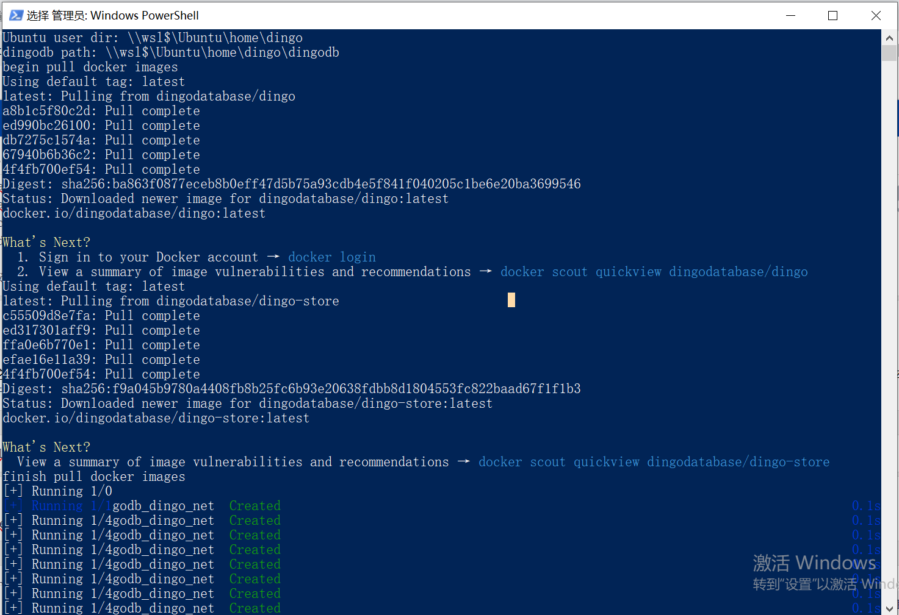

### 7）查看进程
- 通过Docker Tesktop 查看容器状态和资源使用情况。

- 通过 localhost：22001或者127.0.0.1：22001 查看 Dingo-store 服务信息。
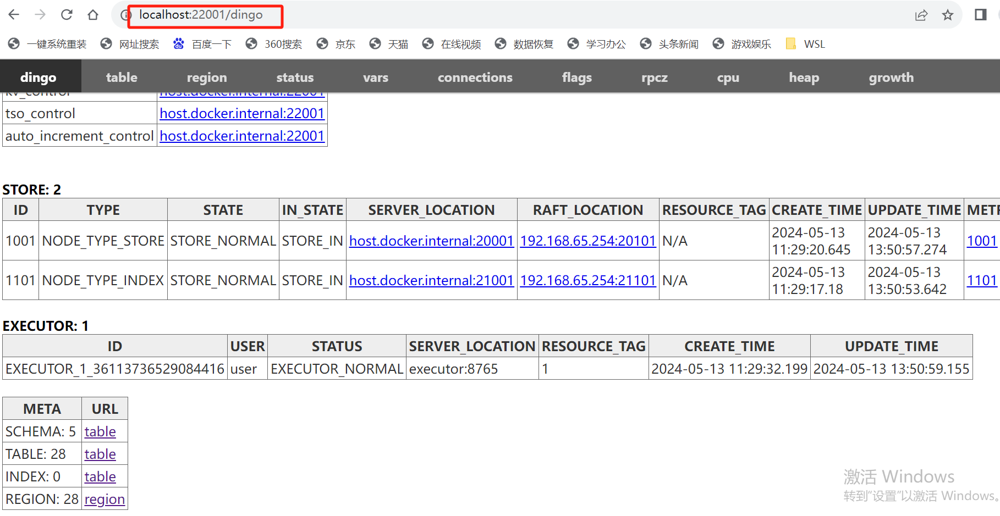

## 4、开启DingoDB之旅

以下提供两种使用方式。

### _DBeaver_

### 1）创建一个连接
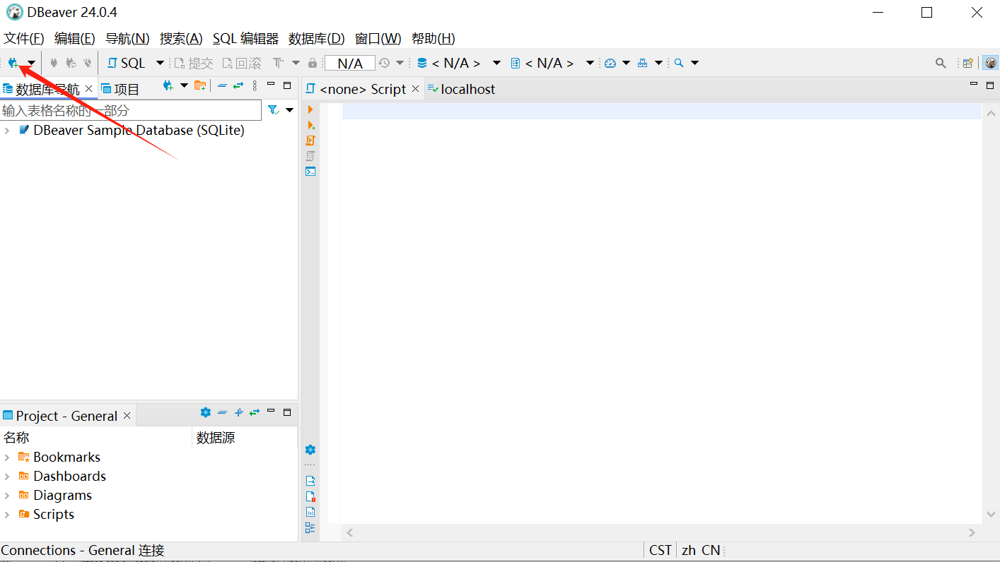

### 2）选择Mysql驱动
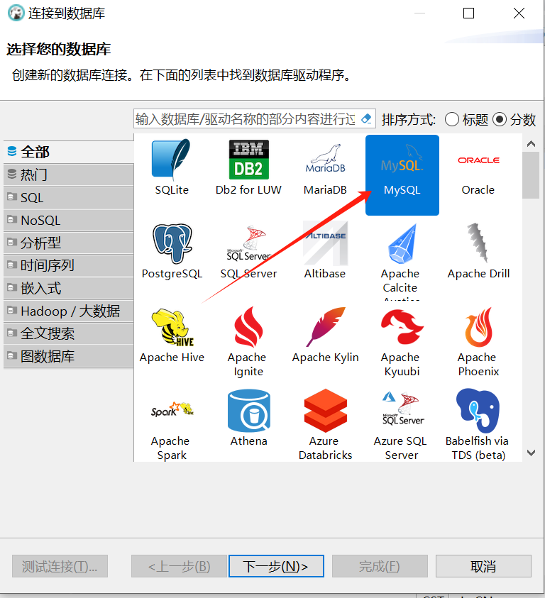

### 3）配置连接参数
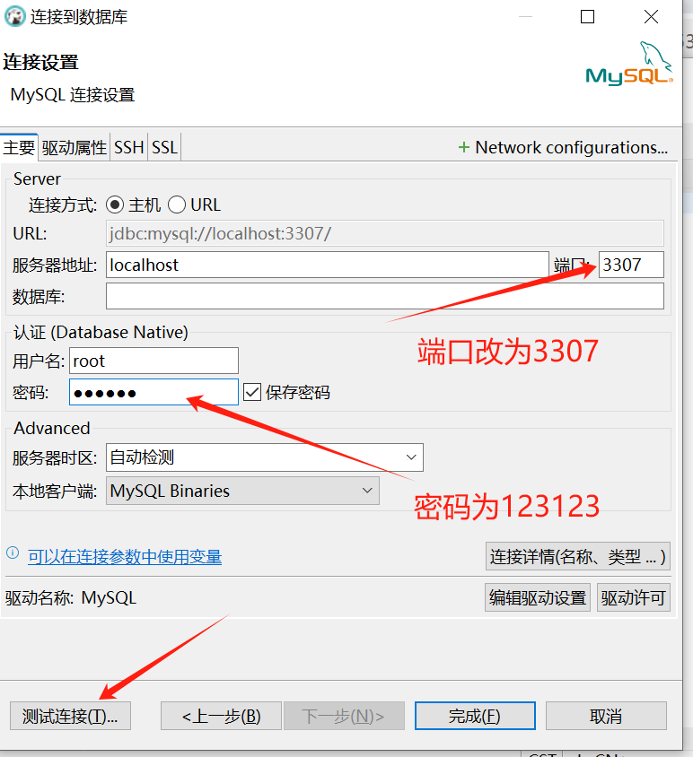

### 4）测试链接
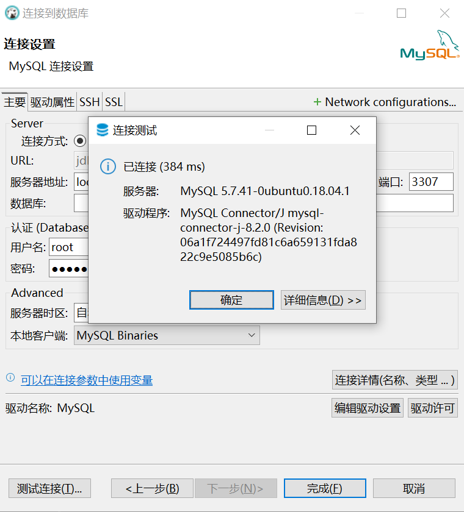

### _Mysql客户端_

### 1）安装Mysql客户端
> apt-get update
> apt-get install -y mysql-client

### 2）查看Mysql版本，建议使用v8.0.36及以上的版本
> mysql --version
> mysql  Ver 8.0.36 for Linux on x86_64 (Source distribution)

### 3）连接DingoDB
密码默认为：123123
> mysql -h 127.0.0.1 -P 3307 -uroot -p ******