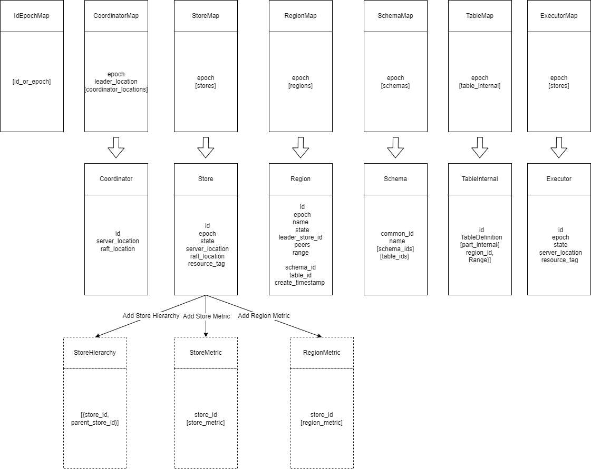
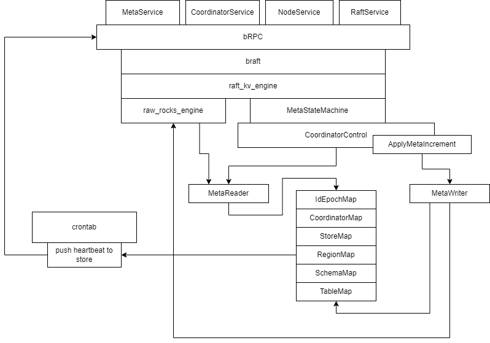
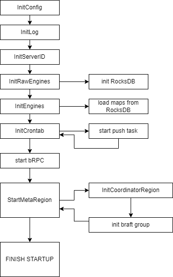

# Coordinator架构设计

## 一、前言
Coordinator的数据结构和集群管理相关的流程在集群管理机制中有较为详细的描述，本文主要描述Coordinator的代码模块分布和主要代码流程。

## 二、数据结构

Coordinator主要维护了6个主要的Map：
 - **IdEpochMap**：保存所有Map的 epoch，以及所有intance的id（coordinator、store、schema、table）；
 - **CoordinatorMap**：保存所有Coordinators信息和状态；
 - **StoreMap**：保存所有Store的信息和状态；
 - **RegionMap**：作为最重要的一个Map，保存所有Region的信息和状态；
 - **SchemaMap与TableMap**：分别保存schema和table的信息，对于table来说，保存了table→region的映射关系。

## 三、代码模块

 - **MetaService**：数据库Schema和Table相关的服务，使用server_location；
 - **CoordinatorService**：集群管理相关的服务，使用server_location；
 - **NodeService**：集群内查询节点信息的服务，使用raft_location；
 - **RaftService**：Raft数据同步的服务，使用raft_location；

## 四、流程说明
### 1、启动流程

## 五、其他说明
'CoordinatorControl'类作为整个Coordinator的核心控制逻辑类，不仅负责所有Brpc service的逻辑处理，还维护6个Map在内存中的缓存，这些缓存的生命周期与CoordinatorControl实例的生命周期相互绑定。