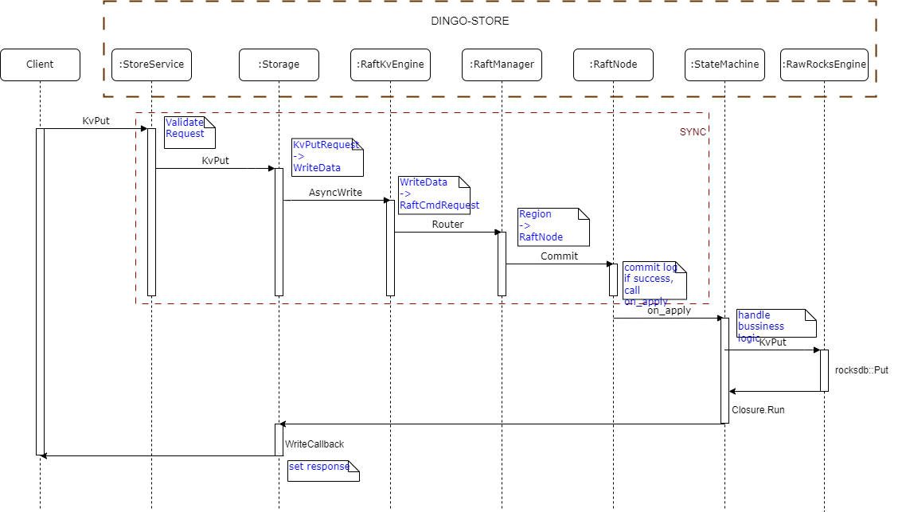
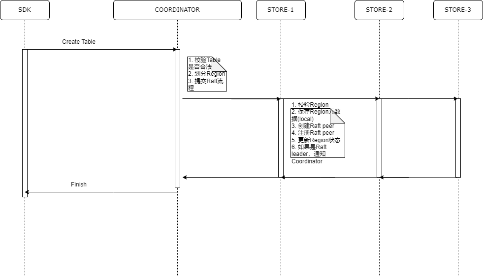
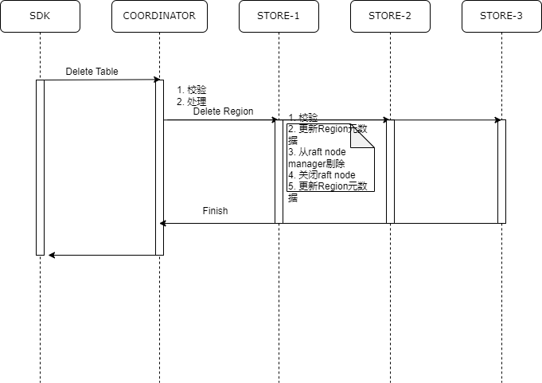

# Store架构设计

## 一、设计目标
  各模块高度解藕，组件化，组件之间不直接依赖，组件可以有多种实现，使得系统具有强扩展性。

## 二、架构设计

Storage负责管理整个存储，存储引擎分两层， 上层为Engine，下层为RawEngine 。Engine和RawEngine是抽象接口类，可以有多种实现，比如：RocksEngine、RaftKvEngine、MemEngine等。

RawEngine是底层引擎，相当于Wrapper，也可以有多种实现。Engine内部可以包含RawEngine。
* RaftKvEngine是基于Raft的存储引擎，是分布式的，生成环境使用。
* RocksEngine是单节点存储引擎，单副本，既可以可以在生产环境使用，也可以测试使用。
* MemEngine是一个基于内存的存储，主要用于测试。
* RawRocksEngine是RocksDB的直接封装，封装RocksDB使用实现细节，提供易用的接口给上层。

**详细设计**

Region作为DingoDB数据库系统中数据分布和调度的基本单位，它支持动态迁移、分裂及合并操作，能够灵活应对数据增长与负载变化。且每个Region对应到一个的Raft Group，确保了数据复制和一致性处理的高效与可靠性。另外Region的Raft日志是独立维护的，为数据的变更历史提供了清晰的记录和恢复能力。Node上的所有Region共享同一个RocksDB，通过管理机制实现了高效的空间利用和快速的数据访问，优化整体的系统性能和资源利用率。

## 三、存储流程
这里使用Key/Value内存存储，由于Key/Value是一个二进制字节数组，因此直接用std::string存储不是很合适。您可以使用RocksDB的Slice类来表示它，这可以减少数据传输过程中的数据复制。

### 1.KvPut流程

### 2.KvGet流程

### 3.Create Table/Region

**注释：**

Region具有两个状态，一个是与Region对应的Peer的状态（Region-Peer-state），另一个是Region的状态（Region-state）。Region-state由Coordinator维护，Region-Peer-state由Store维护。

**流程说明：**

    1）校验是否能创建分区；
        epoch==0&&state=NEW && NotExist(region)
        Range是否合法
        peers包含当前store节点
    2）保存Region元数据；
    3）创建Raft peer；
    4）初始化Raft peer；
    5）添加到Raft node manager；
    6）更新Region状态；
    7）如果是Raft leader，将会通知coordinator。

### 4.Delete Table/Region
  

**注释：**

Coordinator收到超过一半Store删除成功，才认为删除表成功。

**流程说明：**

    1）校验是否能销毁Region；
    2）更新Region元数据；
    3）准备销毁Region；
    4）从Raft node manager剔除；
    5）关闭Raft node；
    6）更新Region元数据；
    7）通知Coordinator。

## 四、元数据管理
 **StoreServerMeta**：管理store节点的状态，不用持久化，store节点启动时可以从配置文件获得。
 
 **StoreRegionMeta**：管理store节点上所有的region元信息，由于Region信息需要持久化，所以这些元信息会被定期上报给coordinator。
* 持久化
    * key: META_REGION_{region_id}
    * value: pb协议pb::common::Region序列化
    * 只保留最新版本
    * 当region状态有变化时立即持久化
    * 通过epoch字段来表示region的版本，当region状态改变时epoch也会跟着变化，epoch单调递增
 
 **StoreMetaManager**：管理store所有的元数据，包括StoreServerMeta和StoreRegionMeta。