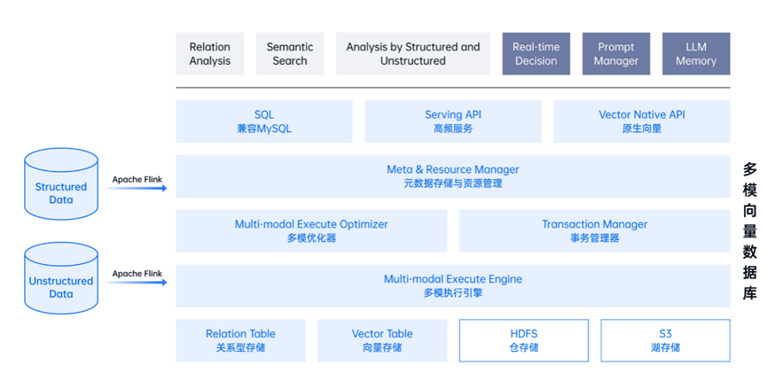

# 总体架构设计

DingoDB作为一款多模向量数据库，专为处理复杂且庞大的数据结构设计，其采用分布式架构确保数据的高性能、高可用和可扩展性，满足现代数据密集型应用对数据处理和查询的严格要求。本文档向用户概述DingoDB核心架构组件。

- **存储层**：负责持久化存储多模数据。DingoDB实现了多模数据的统一存储，包括结构化数据、非结构化数据。通过优化数据分区、引入多副本机制，不仅保障了数据的可靠性和可用性，还对数据的存储效率有所提升。
- **计算层**：负责执行数据处理和查询操作。DingoDB集成了多模优化器和事务管理器，通过查询优化和向量化处理，确保了对大规模多模数据的快速处理能力，同时保证了数据的一致性和完整性。
- **资源管理层**：资源管理层负责整个系统的资源调度和元数据管理，通过资源调度和监控告警，实现了资源的动态分配和系统的稳定运行，为系统的高性能运行提供了坚实保障。
- **接口层**：提供了多种灵活的数据访问模式，除基础的SQL查询语言之外、还提供了开发人员工具包（SDK）和应用程序编程接口（API），以满足不同用户的需求。
- **应用层**：Dingo在应用层面广泛支撑多种高级数据分析与查询场景，包括但不限于关系型数据的深度分析、复杂的语义查询功能，以及实现结构化与非结构化数据的联合查询能力。与此同时，还能够支撑大模型应用场景。